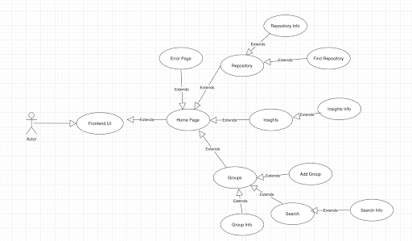

Use Case: 
-----------------------------------------------------------------------------------------------------------------------------------------------------------

Title
-----------------------------------------------------------------------------------------------------------------------------------------------------------
Front End Update 

Description
-----------------------------------------------------------------------------------------------------------------------------------------------------------
An altercation made to the front end of augur that allows for more ease of use and quality of life.

Triggers
-----------------------------------------------------------------------------------------------------------------------------------------------------------
UI interaction 

Actors
-----------------------------------------------------------------------------------------------------------------------------------------------------------
User
Administrator 

Preconditions 
-----------------------------------------------------------------------------------------------------------------------------------------------------------
An existent backend that is connected to databases and data collection workers to provide information to show on the frontend

Main success scenario 
-----------------------------------------------------------------------------------------------------------------------------------------------------------
The UI is intuitive and has minimal issues when in use

Alternative success scenario
-----------------------------------------------------------------------------------------------------------------------------------------------------------
N/A 

Failed End Condition
-----------------------------------------------------------------------------------------------------------------------------------------------------------
The updated UI and/or front end has progressing issues
Such as double clicking links
Confusing management of displayed data

Extensions
-----------------------------------------------------------------------------------------------------------------------------------------------------------
An MVC design that connects the happenings of the User’s viewport with the machinations of augur’s data collection

Steps of Execution
-----------------------------------------------------------------------------------------------------------------------------------------------------------
User lands on the home page
User can then navigate to the page with the navbars to either then view repositories, insights, and/or groups 
From each of the mentioned components the user can navigate to their respective info page 
If the user encounters an error they can click the back button returning them to the navbar page 
From the groups component the user can search for a specific group repository and if the user needs help they can access the search info similarly for the repository component the user can also use the find repository feature 

UML Diagram
-----------------------------------------------------------------------------------------------------------------------------------------------------------

