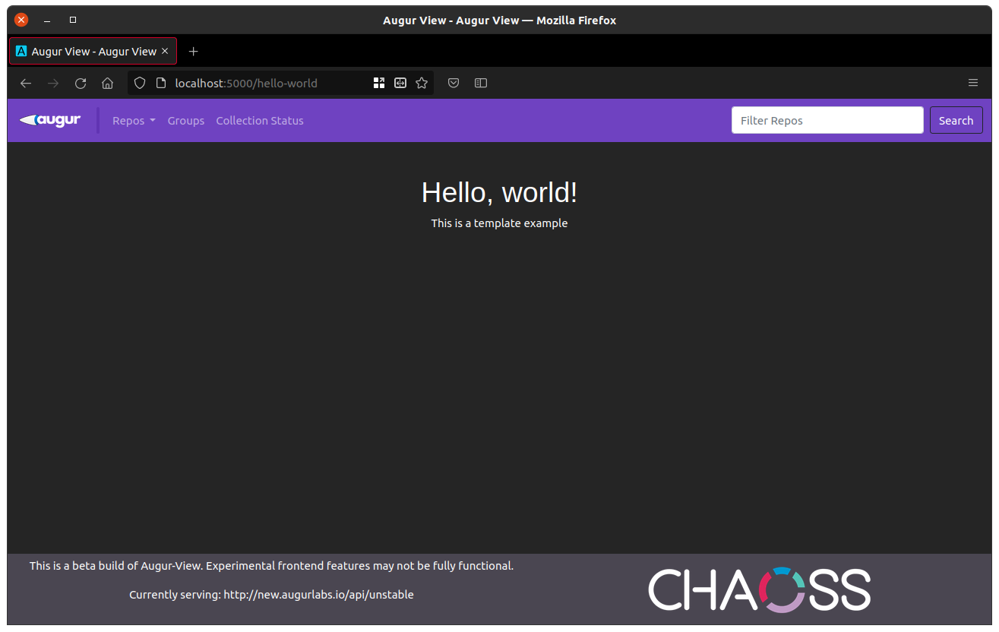

# Writing Modules for augur_view

Modules are a way to integrate templates into the existing structure of augur_view automatically. All of the styles and session variables used to compose the frontend are implicitly available to modules.

Modules are built atop flask templates, so it helps if you are familiar with them as well.

## Rendering

Modules are located in the `templates` folder, and adding a new module takes only 3 steps. Let's walk through a simple example:

1. Create `hello_world.html` in the templates directory.
2. Add content to the template
```html
<h1>Hello, world!</h1>
<p>This is a template example</p>
```
3. Add a route for your template to `augur_view.py`
```python
""" ----------------------------------------------------------------
Hello World example:
    This is an example demonstrating the use of modules.
"""
@app.route('/hello-world')
def hello_world():
    return render_module("hello-world")
```

The `render_module` function is used to automatically compose and return a template with the supplied module as the body of the page. We can see our new page by navigating to `/hello-world` on our instance.



## Accessing information

You can send information to a page using `render_module` in the same way that you can for regular flask templates.

### Template arguments

In this example, let's pass the header into our page as an argument:
```html
<h1>{{ header }}</h1>
<p>This is a template example</p>
```

```python
return render_module("hello-world", header="Hello, World!")
```

### Special arguments

There are also a few special arguments which interact automatically with the frontend framework. For instance, we can change the title displayed for our module by passing in a new title:
```python
return render_module("hello-world", title="Hello, World!")
```


