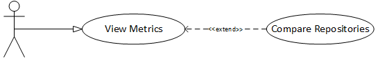

# Title: 3-foundation

## Background
Open source foundations provide support to open source communities. To provide
effective guidance, a foundation needs to have an accurate understanding of the
current health and sustainability of a community. By regularly checking metrics,
the foundation can pro-actively respond to changing conditions and to
early-indicators. Similarly, foundations can understand the health and
sustainability of a community before agreeing to support it.

## Description
The user (foundation) provides a URL to a GitHub repository for a community that
she wants to provide with guidance. The software returns
[metrics](https://wiki.linuxfoundation.org/oss-health-metrics/metrics)
that indicate the health and sustainability of the repository.

## Triggers (What prompts the use case to start?)
1. A user (foundation) seeks to understand the current health and sustainability
   of a repository to devise actionable advice and guidance.
2. A manager seeks to understand the current health and sustainability of their projects to proactivly responed to issues. 

## Actors (Who is involved?)
1. Manager
2. Open Source Foundation

## Preconditions (This includes things like “data loaded”. Or, project is flagged as “of interest”; etc.)
1. User provides URL to a GitHub repository

## Main Success Scenario
1. All metrics that can be computed from the provided repository are displayed.

## Alternate Success Scenarios
1. N/A

## Failed End Condition
1. The provided URL points to a non-existent GitHub repository, metrics cannot
   be calculated, and an error message explaining the condition is shown to user.
2. The GitHub repository does not have enough contributions to calculate metrics
3. The user does not have permissions to view that repository

## Extensions
1. Compare metrics between repositories.

## Steps of Execution (Requirements)
1. The use enters and submits the URL to a GitHub repository.
2. Metrics computed from the provided repository are displayed.

## Dependent Use Cases
1. N/A

## A use case diagram, following the UML Standard for expressing use cases.

