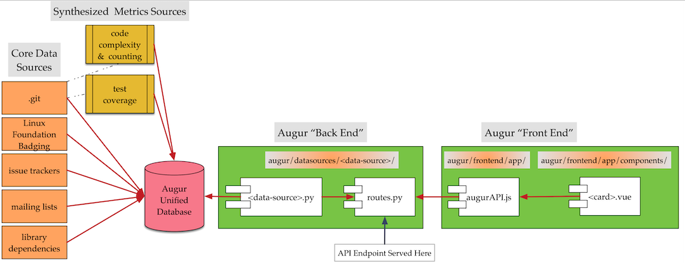

Create Your First Metric
===============================

.. role:: raw-html-m2r(raw)
   :format: html

Building a new metric in Augur involves four main steps. Two steps are in the "back end" and two are in the "front end".

1. Backend:
	- Pull the result set you need out of the Augur Unified Schema.
	- Define the API Route for the endpoint.
2. Frontend
	- Map the route to the front end in `augurAPI.js`
	- Reference the endpoint from `augurAPI.js` as a datasource in a .VUE card.

*The data served by Augur comes from a variety of sources, including .git repositories, issue trackers, mailing lists, Linux Foundation Badging programs, code coverage analysis tools and others.  All of the data is persisted by Augur's workers in a unified data model. Once the data is persisted, its ready to be served as API endpoints; which can be presented in Augur's front end or by any other presentation environment chosen.  There are four basic steps, two in the front end, and two in the backend.  In the backend, there's a <datasource>.py file in the `augur/datasources/<data-source>/` directory. Several are included, like `ghtorrent`, `facade`, `augurDB` and others. Look in the `datasources` directory for specific existing implementations. API Endpoints are served by the `routes.py` file in each `<data-source>` directory. Once the API "exists", the endpoint can be mapped in Augur's frontend through the `augurAPI.js` file in `augur/frontend/app/`. VUE cards present that data graphically in `<card>.vue` files.*

Follow the Steps
--------------------------------------
1. **Metric Implementation**
  - Metrics based on the Augur Unified Database are implemented in  ``augur/datasources/augur_db/augur_db.py``
  - Any new metric you want to implement must be implemented in ``augur/datasources/augur_db/augur_db.py`` as a function of the ``Augur`` class.
  - The metric implementation must accept ``repo_group_id`` and ``repo_id`` arguments.
  - Consider the following metric implementation as an example:

  .. code-block:: python
    :linenos:

    @annotate(tag='code-changes')
    def code_changes(self, repo_group_id, repo_id=None, period='day', begin_date=None, end_date=None):
        """
        Returns a timeseries of the count of code commits.

        :param repo_group_id: The repository's repo_group_id
        :param repo_id: The repository's repo_id, defaults to None
        :param period: To set the periodicity to 'day', 'week', 'month' or 'year', defaults to 'day'
        :param begin_date: Specifies the begin date, defaults to '1970-1-1 00:00:00'
        :param end_date: Specifies the end date, defaults to datetime.now()
        :return: DataFrame of commits/period
        """
        if not begin_date:
            begin_date = '1970-1-1 00:00:00:00'
        if not end_date:
            end_date = datetime.datetime.now().strftime('%Y-%m-%d %H:%M:%S')

        code_changes_SQL = ''

        if not repo_id:
            code_changes_SQL = s.sql.text("""
                SELECT
                    date_trunc(:period, cmt_committer_date::DATE) as commit_date,
                    repo_id,
                    COUNT(cmt_commit_hash) as commit_count
                FROM commits
                WHERE repo_id IN (SELECT repo_id FROM repo WHERE repo_group_id=:repo_group_id)
                AND cmt_committer_date BETWEEN :begin_date AND :end_date
                GROUP BY commit_date, repo_id
                ORDER BY repo_id, commit_date
            """)

            results = pd.read_sql(code_changes_SQL, self.db, params={'repo_group_id': repo_group_id, 'period': period,
                                                                     'begin_date': begin_date, 'end_date': end_date})
            return results

        else:
            code_changes_SQL = s.sql.text("""
                SELECT
                    date_trunc(:period, cmt_committer_date::DATE) as commit_date,
                    COUNT(cmt_commit_hash) as commit_count
                FROM commits
                WHERE repo_id = :repo_id
                AND cmt_committer_date BETWEEN :begin_date AND :end_date
                GROUP BY commit_date
                ORDER BY commit_date
            """)

            results = pd.read_sql(code_changes_SQL, self.db, params={'repo_id': repo_id, 'period': period,
                                                                     'begin_date': begin_date, 'end_date': end_date})
            return results

  - Let's breakdown this example:

    - The metric being implemented here is the 'Code Changes' metric.
    - It is placed in the *Evolution* section because it is an Evolution Metric. Other such groups of metrics that exists are Value, Risk and Diversity & Inclusion. If the metric you want to implement is not a part of any of these metric groups, it must be placed in the *Experimental* section.
    - ``@annotate(tag='code-changes')`` makes the function visible in the metrics-status.
    - ``def  code_changes(self, repo_group_id, repo_id=None, period='day', begin_date=None, end_date=None)`` defines the function ``code_changes`` that implements the metric 'Code Changes.'

      - All metric implementation functions must be able to work on single repositories and repository groups. Therefore they must accept ``repo_group_id`` and ``repo_id`` arguments.
      - Additional arguments can also be accepted by the function. In the example above, ``code_changes`` function takes in additional arguments such as ``period``, ``begin_date`` and ``end_date``.

    - The ``code_changes`` function has two SQL queries that query the Unified Augur Database. One query handles Repository Groups while the other handles Repositories.
    - The function returns a pandas DataFrame.

2. **Adding Routes**
  - After implementing the metric, you must add a Route or API endpoint to access the metric. Routes for the metrics are added in the ``routes.py`` file in the ``augur/datasources/augur_db`` directory.
  - In the ``create_routes`` function in ``routes.py`` file you can add routes using the following two methods:

    - ``server.addRepoGroupMetric(augur_db.<metric>, '<endpoint>')`` to add the endpoint ``/repo-groups/:repo_group_id/<endpoint>`` corresponding to the metric implementation function ``<metric>``.
    - ``server.addRepoMetric(augur_db.<metric>, '<endpoint>')`` to add the endpoint ``/repo-groups/:repo_group_id/repos/:repo_id/<endpoint>`` corresponding to the metric implementation function ``<metric>``

  - Consider the following example:

  .. code-block:: python
    :linenos:

      """
      @api {get} /repo-groups/:repo_group_id/code-changes
      @apiName Code Changes
      @apiGroup Evolution
      @apiDescription <a href="https://github.com/chaoss/wg-evolution/blob/master/metrics/Code_Changes.md">CHAOSS Metric Definition</a>
      @apiParam {String} repo_group_id Repository Group ID
      @apiParam {string} period Periodicity specification. Possible values: 'day', 'week', 'month', 'year'. Defaults to 'day'
      @apiParam {string} begin_date Beginning date specification. Possible values: '2018', '2018-05', '2019-05-01', ..., ' 2017-03-02 05:34:19'. Defaults to '1970-1-1 0:0:0'
      @apiParam {string} end_date Ending date specification. Possible values: '2018', '2018-05', '2019-05-01', ..., ' 2017-03-02 05:34:19'. Defaults to current date & time.
      @apiSuccessExample {json} Success-Response:
                      [
                          {
                              "commit_date": "2018-01-01T00:00:00.000Z",
                              "repo_id": 1,
                              "commit_count": 5140
                          },
                          {
                              "commit_date": "2019-01-01T00:00:00.000Z",
                              "repo_id": 1,
                              "commit_count": 711
                          },
                          {
                              "commit_date": "2015-01-01T00:00:00.000Z",
                              "repo_id": 25001,
                              "commit_count": 1071
                          }
                      ]
      """
      server.addRepoGroupMetric(augur_db.code_changes, 'code-changes')

  - The last line ``server.addRepoGroupMetric(augur_db.code_changes, 'code-changes')`` is what actually creates the ``/repo-groups/:repo_group_id/code-changes`` endpoint and links it to ``code_changes`` metric implementation function.
  - The rest is just annotation used to create documentation.

1. augur/augur/datasources/\ :raw-html-m2r:`<directory for data source>`

   #. example: ghtorrent
   #. example file 1: ghtorrent.py

      * create a new function that has the sql query to the database, or API call to GitHub or whatever. But if you're in ``ghtorrent.py`` (or ``facade.py``\ ), its a sql query. Here's an example breakdown:

        * ``@annotate(tag='code-review-iteration') makes the function visible in metrics-status``

          * ``def code_review_iteration..`` is the name of the function called in ``routes.py`` **in the same data source folder** (which is ``augur/augur/datasources/ghtorrent`` in our example

.. code-block:: python
   :linenos:

   @annotate(tag='code-review-iteration')
           def code_review_iteration(self, owner, repo=None):
           """
           Timeseries of the count of iterations (being closed and reopened) that a merge request (code review) goes through until it is finally merged

           :param owner: The name of the project owner or the id of the project in the projects table of the project in the projects table. Use repoid() to get this.
           :param repo: The name of the repo. Unneeded if repository id was passed as owner.
           :return: DataFrame with iterations/issue for each issue that week
           """
           repoid = self.repoid(owner, repo)

           codeReviewIterationSQL = s.sql.text("""
           SELECT
               DATE(issues.created_at) AS "created_at",
               DATE(pull_request_history.created_at) AS "merged_at",
               issues.issue_id AS "issue_id",
               pull_request_history.pull_request_id AS "pull_request_id",
               pull_request_history.action AS "action",
               COUNT(CASE WHEN action = "closed" THEN 1 ELSE NULL END) AS "iterations"
           FROM issues, pull_request_history
           WHERE find_in_set(pull_request_history.action, "closed,merged")>0
           AND pull_request_history.pull_request_id IN(
               SELECT pull_request_id
               FROM pull_request_history
               WHERE pull_request_history.action = "closed")   #go by reopened or closed??? (min: completed 1 iteration and has started another OR min: completed 1 iteration)
           AND pull_request_history.pull_request_id = issues.issue_id
           AND issues.pull_request = 1
           AND issues.repo_id = :repoid
           GROUP BY YEARWEEK(issues.created_at) #YEARWEEK to get (iterations (all PRs in repo) / week) instead of (iterations / PR)?
           """)

           df = pd.read_sql(codeReviewIterationSQL, self.db, params={"repoid": str(repoid)})
           return pd.DataFrame({'date': df['created_at'], 'iterations': df['iterations']})

	* Need the New API Documentation Here.

`server.py`

.. code-block:: python
	:linenos:

	    def addRepoGroupMetric(self, function, endpoint, **kwargs):
	        """Simplifies adding routes that accept repo_group_id"""
	        endpoint = f'/{self.api_version}/repo-groups/<repo_group_id>/{endpoint}'
	        self.app.route(endpoint)(self.routify(function, 'repo_group'))
	        self.updateMetricMetadata(function, endpoint, **kwargs)

	    def addRepoMetric(self, function, endpoint, **kwargs):
	        """Simplifies adding routes that accept repo_group_id and repo_id"""
	        endpoint = f'/{self.api_version}/repo-groups/<repo_group_id>/repos/<repo_id>/{endpoint}'
	        self.app.route(endpoint)(self.routify(function, 'repo'))
	        self.updateMetricMetadata(function, endpoint, **kwargs)

2. example file 2: ``routes.py`` in the same directory, ``augur/augur/datasources/ghtorrent/``

   * ``server.addTimeseries`` (most of the below is annotation. The very last line is what makes it actually work.);;;;

.. code-block:: python
   :linenos:

       """
       @api {get} /:owner/:repo/timeseries/code_review_iteration Code Review Iteration
       @apiName code-review-iteration
       @apiGroup Growth-Maturity-Decline
       @apiDescription <a href="com/chaoss/metrics/blob/master/activity-metrics/code-review-iteration.md">CHAOSS Metric Definition</a>. Source: <a href="http://ghtorrent.org/">GHTorrent</a>

       @apiParam {String} owner Username of the owner of the GitHub repository
       @apiParam {String} repo Name of the GitHub repository

       @apiSuccessExample {json} Success-Response:
                           [
                               {
                                   "date": "2012-05-16T00:00:00.000Z",
                                   "iterations": 2
                               },
                               {
                                   "date": "2012-05-16T00:00:00.000Z",
                                   "iterations": 1
                               }
                           ]
       """
       server.addTimeseries(ghtorrent.code_review_iteration, 'code_review_iteration')

3.   example file 3: 'augurAPI.js' in the ``augur/frontend/app/`` directory needs to have the the metric from ``routes.py`` mapped to an API endpoint that the frontend will then access.

   * Metrics from the facade.py that take a git url should go under the //GIT section in this file
   * Most of your metrics are going to belong in the //GROWTH, MATURITY AND DECLINE section.

.. code-block:: javascript
   :linenos:

     // IN THIS SECTION of augurAPI.js DEVELOPER NOTE

     if (repo.owner && repo.name) {
      // DIVERSITY AND INCLUSION
      // GROWTH, MATURITY, AND DECLINE

      // FIND THE RIGHT SECTION, like "GROWTH, MATURITY AND DECLINE" and ADD YOUR code
      Timeseries(repo, 'closedIssues', 'issues/closed')
      Timeseries(repo, 'closedIssueResolutionDuration', 'issues/time_to_close')
      Timeseries(repo, 'codeCommits', 'commits')
      // Timeseries(repo, 'codeReviews', 'code_reviews')

      // THIS IS THE NEW METRIC IN OUR EXAMPLE
      Timeseries(repo, 'codeReviewIteration', 'code_review_iteration')
     }

4. Example file 4: `ExperimentalCard.vue` in the `augur/frontend/app/components/` directory. We will need to import and insert a chart component that we will be creating next or a chart component that already exists in the `augur/frontend/app/components/charts/ ` directory.

      In the `<script>` section of `ExperimentalCard.vue`, we must import the chart file and add it to the `components` section under `module.exports` like this:

.. code-block::
   :linenos:

      import ExampleChart from `./charts/ExampleChart`

      import DynamicLineChart from './charts/DynamicLineChart'
      import BubbleChart from './charts/BubbleChart'
      import StackedBarChart from './charts/StackedBarChart'
      import DualAxisContributions from './charts/DualAxisContributions'

      module.exports = {
        data() {
          return {
            colors: ["#FF3647", "#4736FF","#3cb44b","#ffe119","#f58231","#911eb4","#42d4f4","#f032e6"]
          }
        },
        components: {
          ExampleChart,

          DynamicLineChart,
          BubbleChart,
          StackedBarChart,
          DualAxisContributions
        }
      }

**TODO** Can we keep the example from above in place?

5. Example file 5: **TODO** <\ :raw-html-m2r:`<FILL IN FILE NAME and PATH>`\ > We insert the ``ExampleChart`` component with our endpoint name (\ ``closedIssues``\ ) defined as the ``source`` property (prop) of the component (Vue converts a string name like 'ExampleChart' to 'example-chart' to be used as an html tag):

.. code-block:: html
   :linenos:

      <example-chart source="closedIssues"
                          title="Closed Issues / Week "
                          cite-url=""
                          cite-text="Closed Issues">
      </example-chart>

6. You will need to create a chart file. **TODO** << Where? What will it be called? What example are we using? >> Here is an example of a chart file that calls the endpoint that is passed as the ``source`` property. The template section holds the vega-lite tag that renders the chart. The Vega-lite ``spec`` is being bound to what is being returned by the ``spec()`` method inside the ``computed`` properties (\ ``:spec="spec"``\ ), and the ``data`` being used for the chart is bound to the ``values`` array being returned by the ``data()`` method (\ ``:data="values"``\ ):

**TODO** Where it goes in this file. Same file?

.. code-block:: html
   :linenos:

      <template>
        

          

            <h3 style="text-align: center">{{ title }}</h3>
            <vega-lite :spec="spec" :data="values"></vega-lite>
            
 {{ chart }} 

          

        

      </template>

**TODO** Where it goes in this file. Same file?

.. code-block:: javascript
   :linenos:

      import { mapState } from 'vuex'
      import AugurStats from 'AugurStats'

      export default {
        props: ['source', 'citeUrl', 'citeText', 'title', 'disableRollingAverage', 'alwaysByDate', 'data'],
        data() {
          return {
            values: [],
          }
        },
        computed: {
          repo() {
            return this.$store.state.baseRepo
          },
          spec() {
              // IF YOU WANT TO CALL YOUR ENDPOINT IN THE CHART FILE, THIS IS WHERE/HOW YOU SHOULD DO IT:
            let repo = window.AugurAPI.Repo({ githubURL: this.repo })
            repo[this.source]().then((data) => {
               // you can print your data in a console.log() to make                   // sure the endpoint is returning what it needs to
              // console.log("HERE", data)
              this.values = data
            })
            //FINISH CALLING ENDPOINT

            // THIS IS A SAMPLE 'spec', SPECS ARE WHAT CREATE THE VEGA-LITE FILE,
            // YOU CAN PLAY WITH SAMPLE SPEC OF A LINE CHART AT:
            // https://vega.github.io/editor/#/examples/vega-lite/line
            // AND SEE THE DATA THAT THEY ARE USING AT:
            // https://vega.github.io/vega-lite/data/stocks.csv
            let config = {
              "$schema": "https://vega.github.io/schema/vega-lite/v2.json",
              "width": 950,
              "height": 300,
              "mark": "line",
              "encoding": {
                "x": {
                  "field": "date", "type": "temporal",
                },
                "y": {
                  "field": "value","type": "quantitative",
                },
              }
            }
            return config
          }
        },
        methods: {
          //define any methods you may need here
          //you can call them anywhere with: this.methodName()
        }
      }
