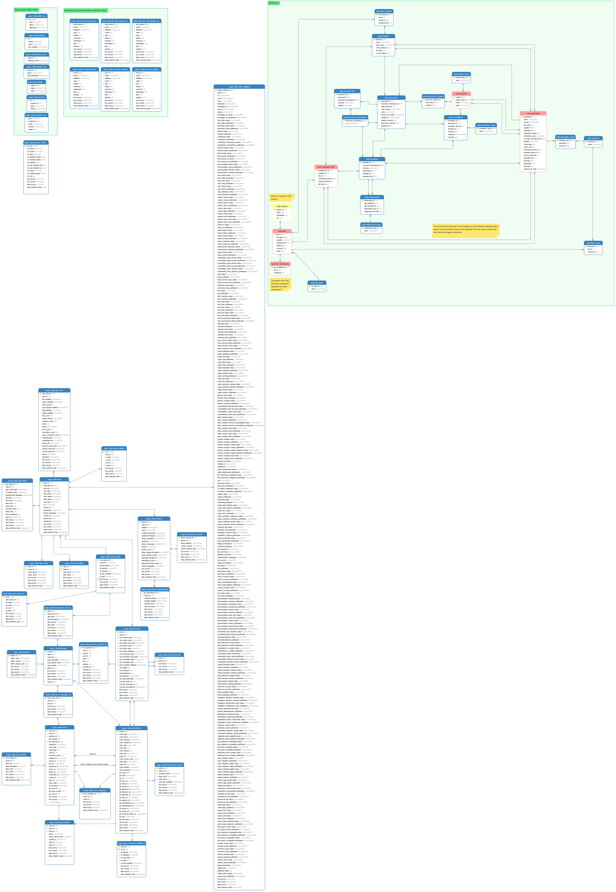

Data Model
===========

The latest version of Augur includes a schema_ that brings together data from : 

1. git repositories, including GitHub
2. issue trackers
3. mailing lists
4. library dependency trees
5. the Linux Foundation's badging program
6. code complexity and contribution counting ... and MUCH MUCH MORE. 

This document details how to create the schema as well as some information on its contents and design.

-----------------------
Creating the schema
-----------------------

This section assumes you have already installed or have access to an
installation of PostgreSQL 10 or 11. More information on PostgreSQL can
be found `here <https://www.postgresql.org/>`__.

From your local terminal, run the following commands, where ``<host>`` the server where your PostgreSQL installation is running, ``<port>`` is the port on which your installation is exposed, and ``<password>`` is a password of your choice.

It's recommended you use the default database name ``augur`` and the default user ``augur`` as shown below, but they are not required.

Make sure to also replace the ``/path/to/augur/`` with the path to the root ``augur/`` directory from your current directory; if you're in the the root ``augur/`` directory, then ``persistence_schema/0-all.sql`` should work just fine. 

.. code:: bash

    psql -h <host> -p <port> -c "CREATE DATABASE augur;"
    psql -h <host> -p <port> -c "CREATE USER augur WITH ENCRYPTED PASSWORD '<password>';"
    psql -h <host> -p <port> -c "ALTER DATABASE augur OWNER TO augur;"
    psql -h <host> -p <port> -c "GRANT ALL PRIVILEGES ON DATABASE augur TO augur;"
    psql -h <host> -d augur -U augur -p <port> -a -w -f /path/to/augur/persistence_schema/0-all.sql

Example (note this will **not**) work\:

.. code:: bash

    psql -h example.com -p 5432 -c "CREATE DATABASE augur;"
    psql -h example.com -p 5432 -c "CREATE USER augur WITH ENCRYPTED PASSWORD 'password123';"
    psql -h example.com -p 5432 -c "ALTER DATABASE augur OWNER TO augur;"
    psql -h example.com -p 5432 -c "GRANT ALL PRIVILEGES ON DATABASE augur TO augur;"
    psql -h example.com -d augur -U augur -p 5432 -a -w -f /Users/carterlandis/augur/persistence_schema/0-all.sql

----------------
Schema Overview
----------------

Augur Data
----------

The ``augur_data`` schema contains *most* of the information analyzed
and constructed by Augur. The origin’s of the data inside of augur are:
1. ``workers/augur_github_worker``: Pulls data from the GitHub API.
Presently this is focused on issues, including issue_comments,
issue_events, issue_labels and contributors. Note that all messages are
stored in Augur in the ``messages`` table. This is to facilitate easy
analysis of the tone and characteristics of text communication in a
project from one place. 2. ``workers/facade_worker``: Based on
http://www.github.com/brianwarner/facade, but substantially modified in
the fork located at http://github.com/sgoggins/facade. The modifications
include modularization of code, connections to Postgresql data instead
of MySQL and other changes noted in the commit logs. 3.
``workers/insight_worker``: Generates summarizations from raw data
gathered from commits, issues, and other info. 4.
``workers/linux_badge_worker``: Pulls data from the Linux Foundation’s
badging program. 5. ``workers/code_analysis``: Populates the table
``repo_labor`` using the “SCC” tool provided the
https://github.com/boyter/scc project. This worker is presently in
development and not deployed.

Augur Operations
----------------

The ``augur_operations`` tables are where most of the operations tables
are going to exist. There are a few, like ``settings`` that remain in
``augur_data`` for now, but will be moved. They keep records related to
analytical history and data provenance for data in the schema. They also
store information including API keys.

SPDX
----

The ``spdx`` schema serves the storage for software bill of materials
and license declarations scans on projects, conducted using this fork of
the DoSOCSv2 project: https://github.com/Nebrethar/DoSOCSv2

.. _schema:

--------------------
Complete Data Model
--------------------

