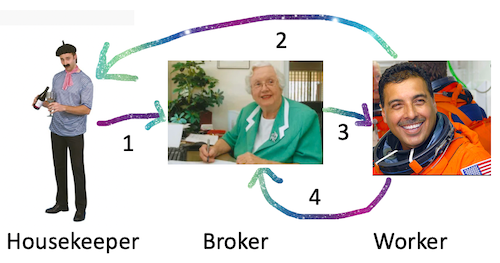
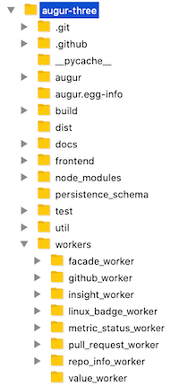

Starting Data Collection Workers
================================

Workers are continuous collection processes that populate parts of Augur's data model. Each worker follows a consistent design that includes: 

1. Having the housekeeper notify the broker of what work needs to be done (1), the worker notifying the housekeeper that its ready to work when it starts (2), the broker passing work to the worker (3), and the worker letting the broker know when its finished (4). 

2. Until the worker starts, the broker listens for the worker on a port specified in the worker block of the augur.config.json file. Each block contains a minimum of four parameters: 

- model: The part of the model populated by the worker 
- given: The parameter passed into the model to scope collection
- delay: How long to pause between collection cycles, expressed in seconds
- repo_group_id: You can specify an array of repo_group_ids, or "0", which will collect all data for all repo_group_id's. 

Augur Model Block
-------------------

.. code-block:: json

    {
        "jobs": [
            {
                "model": "issues",
                "given": ["github_url"],
                "delay": 150000,
                "repo_group_id": 0,
				"all_focused": 1
            },
            {
                "model": "repo_info",
                "given": ["github_url"],
                "delay": 150000,
                "repo_group_id": 0
            },
            {
                "model": "commits",
                "given": ["repo_group"],
                "delay": 150000,
                "repo_group_id": 0
            },
            {
                "model": "pull_requests",
                "given": ["github_url"],
                "delay": 1000000,
                "repo_group_id": 0
            }, 
            {                
            	"model": "contributors",
            	"given": ["github_url"],
                "delay": 1000000,
                "repo_group_id": 0
            },
            {
                "model": "insights",
                "given": ["git_url"],
                "delay": 1000000,
                "repo_group_id": 0
            }
        ]
    }

3. The data collected by the worker is determined by the models listed in the housekeeper block of the augur.config.json file. 

.. _workers-dir:

-------------------------------------------
Locating the Workers: Augur's Oompa Loompas 
-------------------------------------------

.. note:: 

  You'll likely see some linting warnings in the frontend section
  (indicated here by the …). Don’t worry about them: it’s the last 3 lines
  that indicate success.