Creating an Amazon EC2 Instance
===============================
**Creating an Amazon EC2 Instance will allow you to run augur from that instance. You will need Amazon credits, and the instance type must have at least 4GB of memory. Follow the steps below to set up the Amazon EC2 Instance with the correct requirements in order to run Augur!**

|

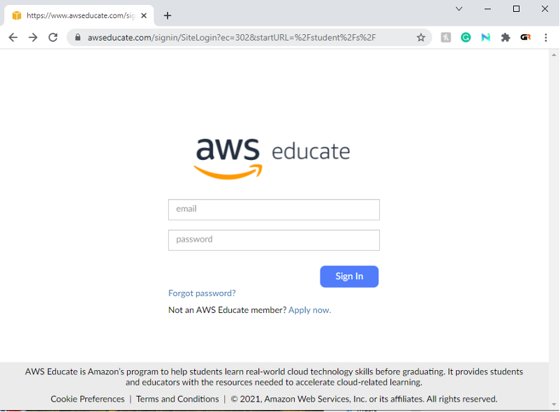

First Log-in to your AWS account

|

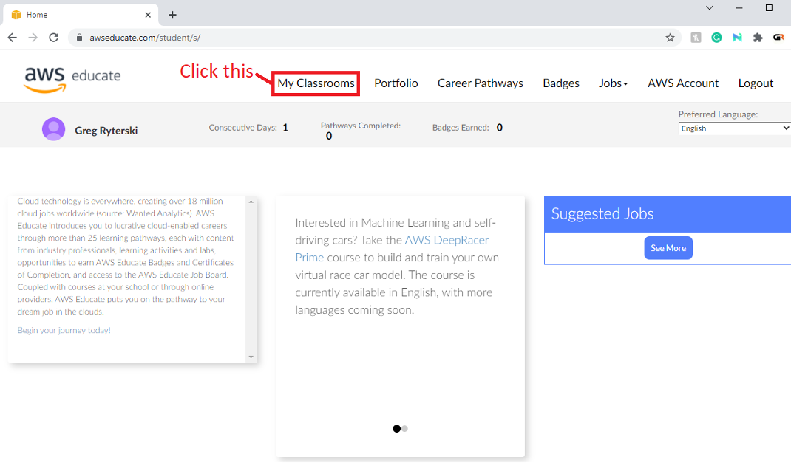

Once you are signed in, go to the “My Classrooms” tab at the top of the screen.

|

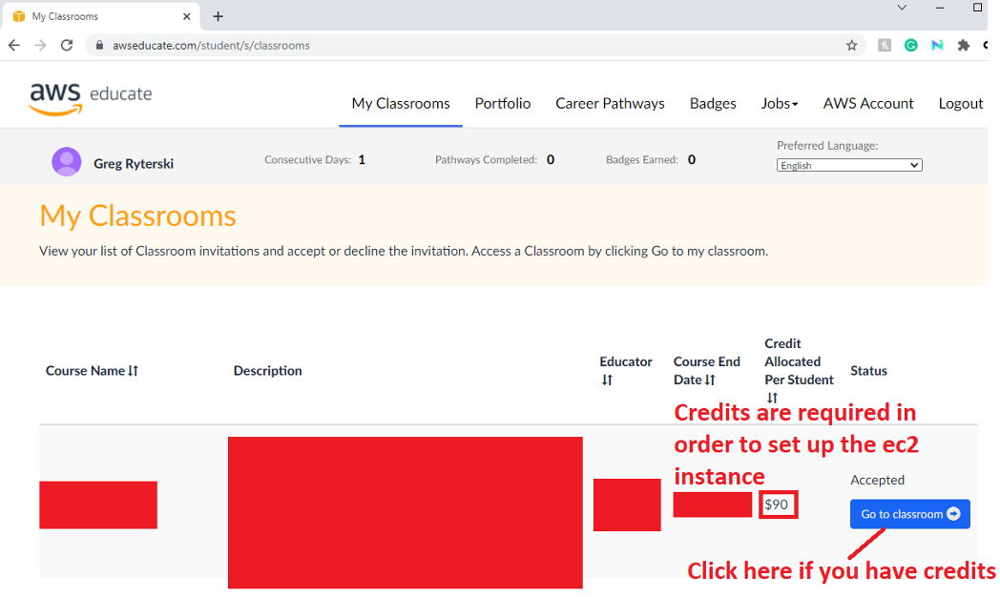

Once you are in the “My Classrooms” tab, check to make sure you have AWS credits. Credits are required to run an Amazon EC2 Instance. If you have credits, click on “Go to classroom” to get started.

|

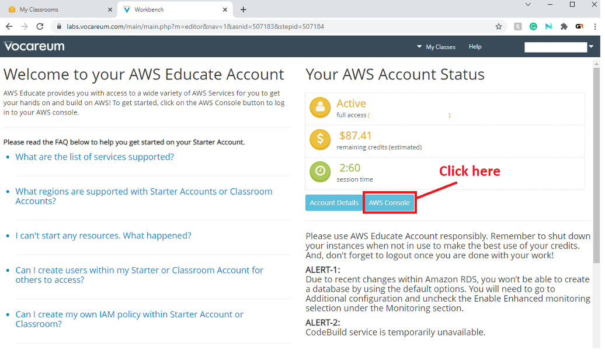

Here, you can see your account status. You will want to click “AWS Console”

|

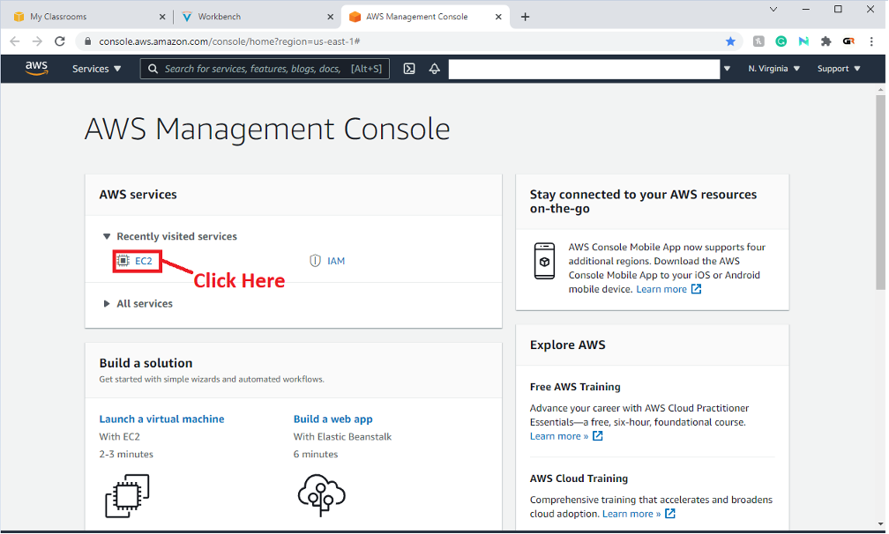

Once you are in the AWS Management Console, click “EC2” under AWS services.

|

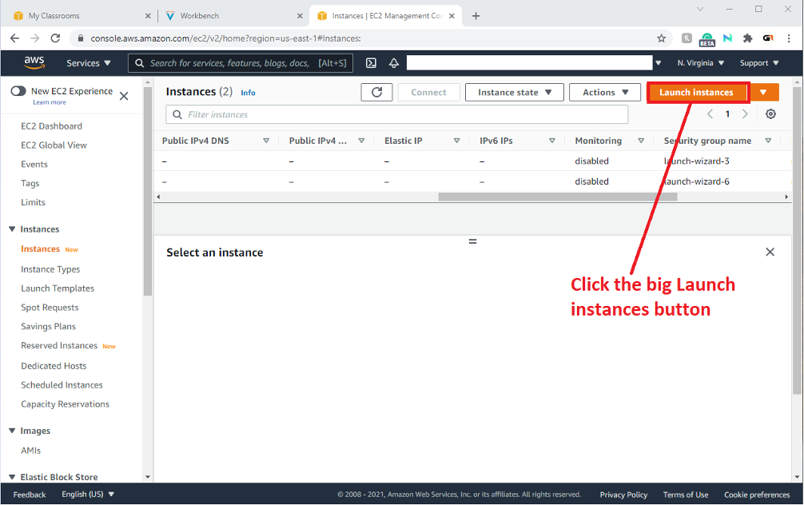

Here is where you can see all of your instances. To create a new one, click the button “Launch Instances”

|

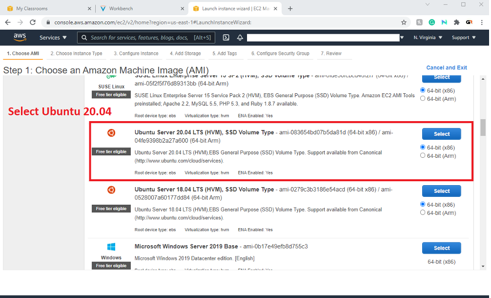

There are many selections to choose from. You are going to want to find “Ubuntu Server 20.04 LTS” and select this option.

|

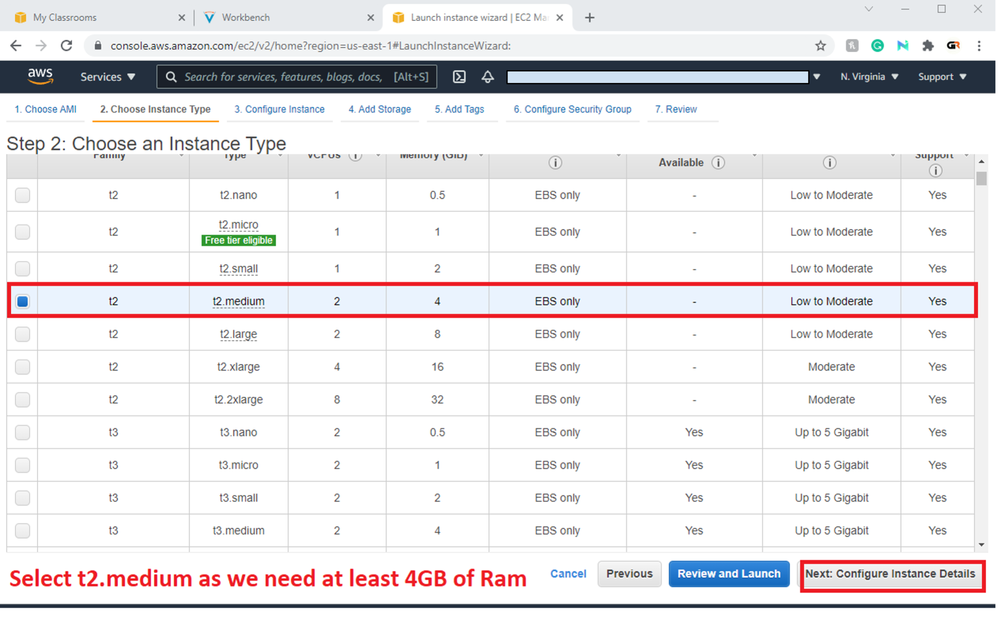

When you are choosing an Instance type, choose one with at least 4GB of memory. Here, we selected the minimum size, but any instance type with at least 4GB of memory will work. Once selected, click “Next: Configure Instance Details”

|

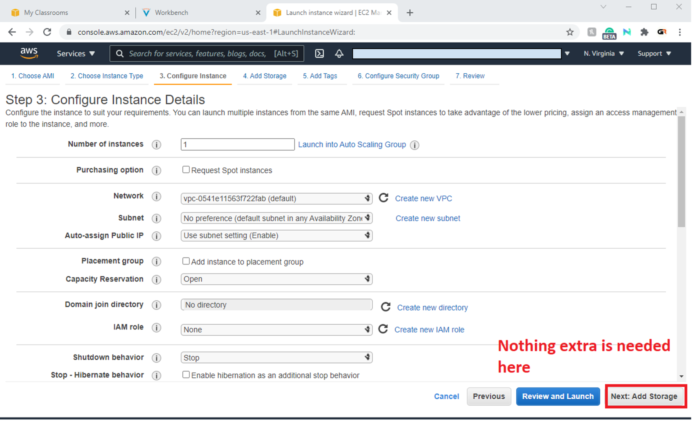

On this page, nothing needs to be added or changed, so just click “Next: Add Storage”

|

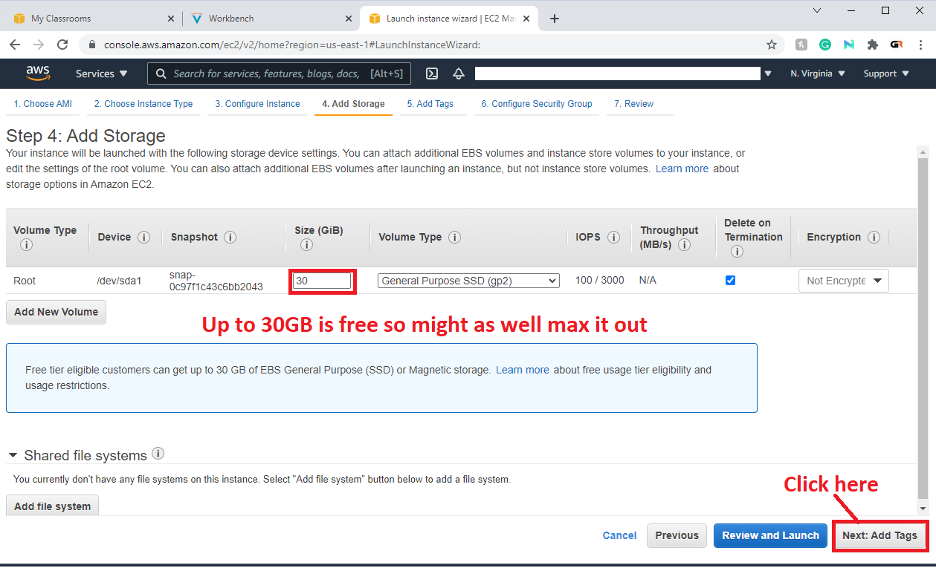

Since Amazon AWS will allow free tier eligible customers to get up to 30GB for free you might as well max it out in case you ever need that much space. Augur takes quite a bit of space itself so this is almost a must. Then click “Next: Add Tags”

|

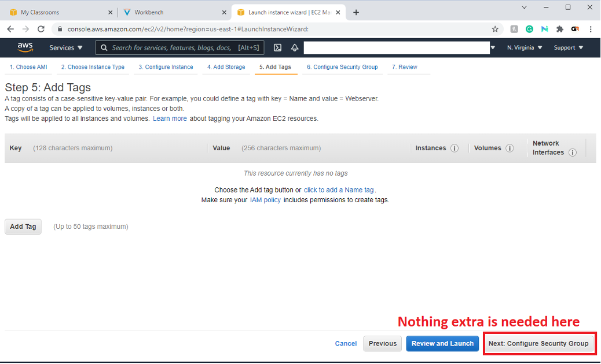

Nothing needs to be done in this section.

|

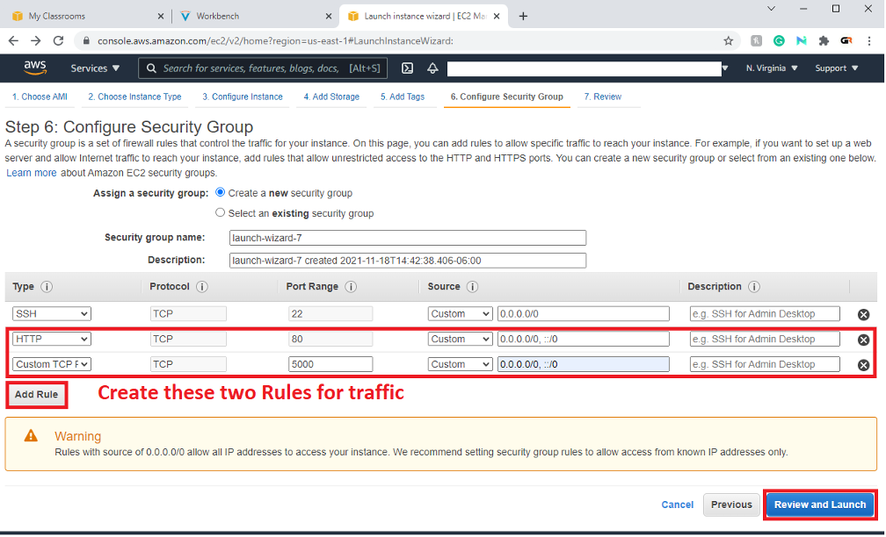

Add these two rules because you’ll want to open up these two ports in order to host the server and see the backend status.

|

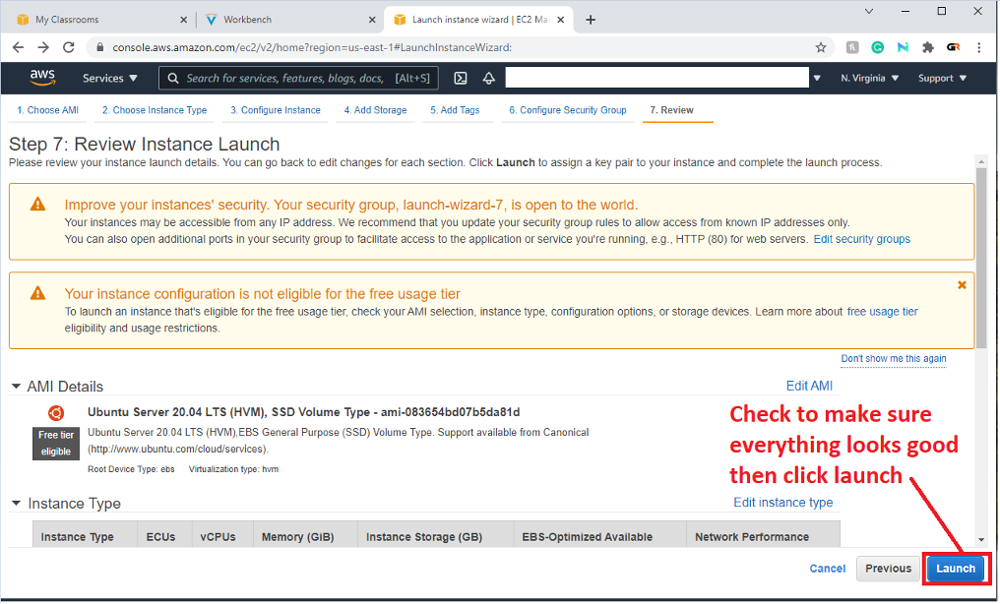

In this step you’re just reviewing that you’ve completed the previous steps correctly.

|

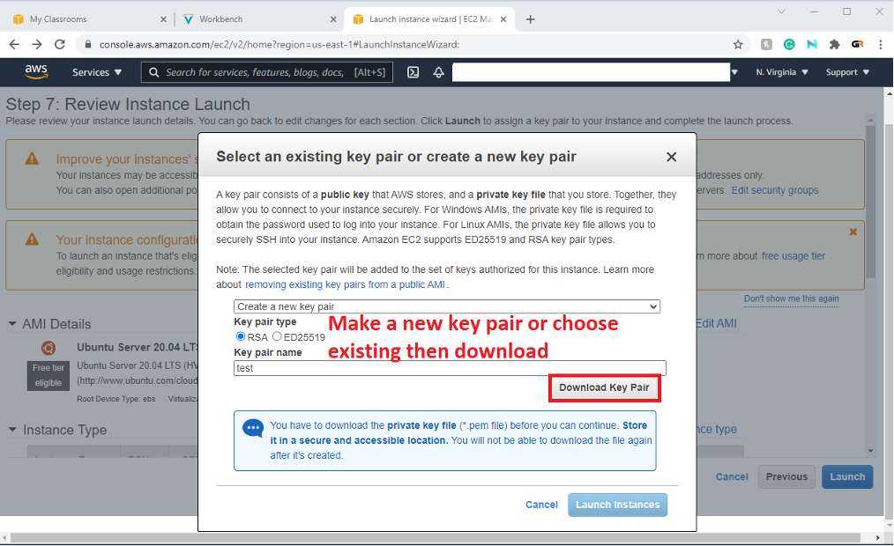

Create a new key-pair of an RSA type with a specific name or choose an existing one you have on your machine. If you’re creating a new key-pair then download it to someplace where you can easily access. You want to do this because it will be later used to ssh into the newly created instance. After the key-pair is set up click the big blue ‘Launch Instances’ button.

|

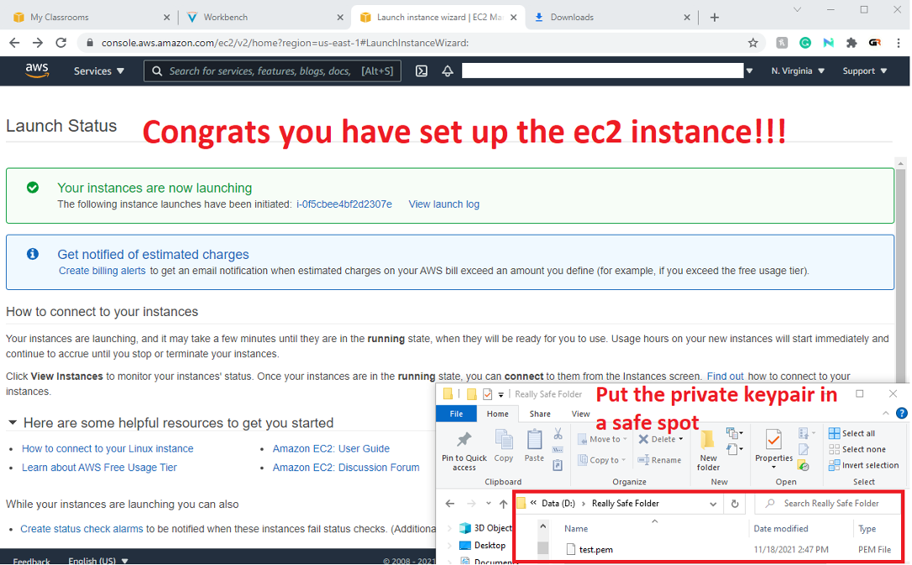

At this point your instance should be good to go. Make sure your instance is running and your key-pair is stored inside a safe, but accessible, folder.

|
