Installation Input Explanations
================================

make install
--------------

The first stopping point you come to in the install will be the following:

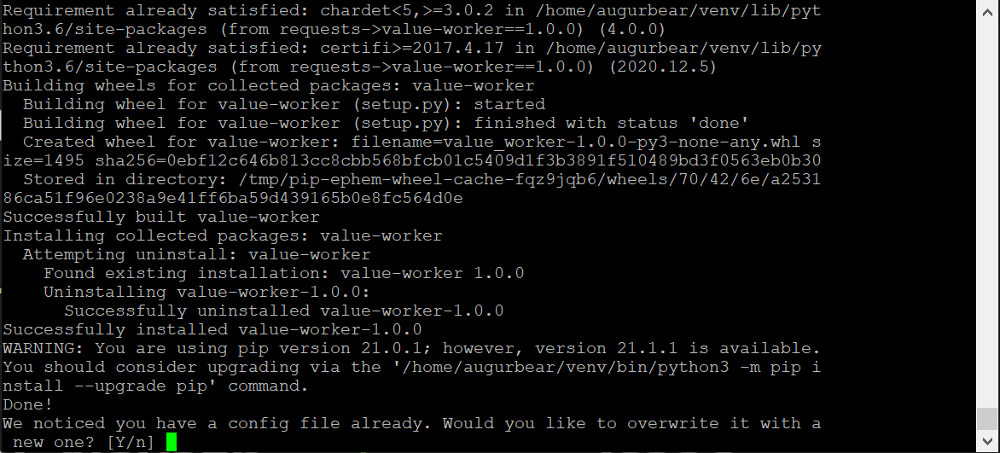

You will be asked to prove the following inputs at this time:

+------------------------------+--------------------------------------------------------------------+
| Input                        | Explanation                                                        |
+==============================+====================================================================+
| Overwrite config file? Y/n   | | Enter “Y” for yes, overwrite the current config with a new file  |
|                              | |  Choose if this is your first time installing Augur              |
|                              | | Enter “n” for no, keep the current config file                   |
+------------------------------+--------------------------------------------------------------------+

If you choose “Y”, the next stopping point will be:

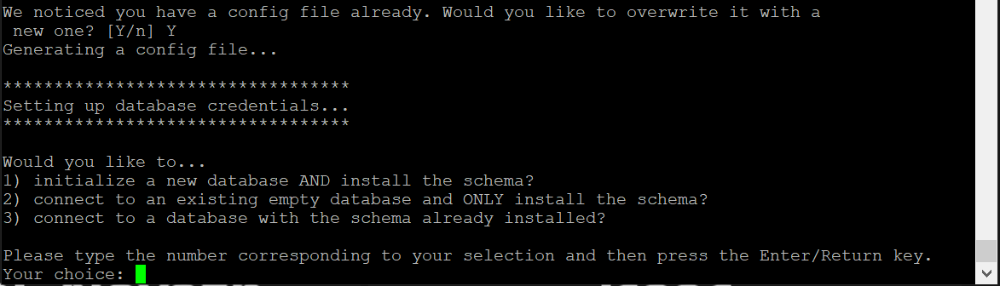

Now you must provide these following inputs:

+-------------------------+-----------------------------------------------------------------------------------------------------------+
| Input                   | Explanation                                                                                               |
+=========================+===========================================================================================================+
| Use new or existing DB  | | Enter “1” if this is your first time running the augur install                                          |
|                         | | Enter “2” if you already created a database with a previous augur install but schema was not installed  |
|                         | | Enter “3” if you already created a database with a previous augur install and                           |
|                         | |  successfully installed the schema                                                                      |
|                         | | See 'database documentation <../../getting-started/database.html>'_ for detail regarding database setup |
+-------------------------+-----------------------------------------------------------------------------------------------------------+

If you choose “1” to initialize a new database, you will now have to enter the following inputs:

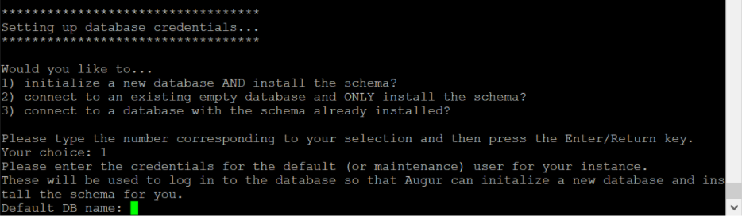

+--------------------------+---------------------------------------------------+
| Input                    | Explanation                                       |
+==========================+===================================================+
| Default DB name          | Enter the name of your postgres database          |
+--------------------------+---------------------------------------------------+
| Default user             | Enter the user name of your postgres database     |
+--------------------------+---------------------------------------------------+
| Default user’s password  | Enter the root password of your postgres database |
+--------------------------+---------------------------------------------------+

Next it will ask you for the host and port of your instance:

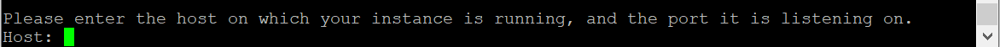

+----------+-------------------------------------------------------------+
| Input    | Explanation                                                 |
+==========+=============================================================+
| Host     | Enter the IP address (hostname) for your postgres database  |
+----------+-------------------------------------------------------------+
| Port     | Enter the port the postgres database is hosted on           |
+----------+-------------------------------------------------------------+

Now, you will be asked for the credentials of the new database

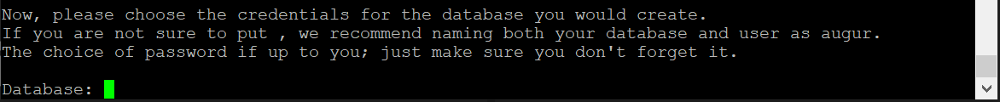

+-----------+--------------------------------------------------------------------------------------------------+
| Input     | Explanation                                                                                      |
+===========+==================================================================================================+
| Database  | | Come up with and enter a name for your new augur database. Remember this or write it down      |
|           | |  You can use anything you want, or just use “augur” as the database                            |
+-----------+--------------------------------------------------------------------------------------------------+
| User      | | Come up with and enter a user name for your new augur database. Remember this or write it down |
|           | |  You can use anything you want, or just use “augur” as the user                                |
+-----------+--------------------------------------------------------------------------------------------------+
| Password  | | Come up with and enter a password for your new augur database. Remember this or write it down  |
|           | |  You can use any password you want.                                                            |
+-----------+--------------------------------------------------------------------------------------------------+

If you choose “2” to connect to an existing database and only install schema or “3” to connect to a database with schema already installed:

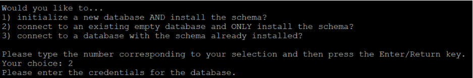

+-----------+-----------------------------------------------------------------------+
| Input     | Explanation                                                           |
+===========+=======================================================================+
| Database  | | Enter the database name that you created on a previous install      |
|           | |  If you can’t remember, try “augur”                                 |
+-----------+-----------------------------------------------------------------------+
| User      | | Enter the user name that you created on a previous install          |
|           | |  If you can’t remember, try “augur”                                 |
+-----------+-----------------------------------------------------------------------+
| Password  | Enter the database password that you created on a previous install    |
+-----------+-----------------------------------------------------------------------+
| Host      | Enter the IP address (hostname) for your postgres database            |
+-----------+-----------------------------------------------------------------------+
| Port      | | Enter the port the postgres database is hosted on                   |
|           | |  Usually this is 5432                                               |
+-----------+-----------------------------------------------------------------------+

------------------------

Next, you will be asked to provide some API keys:

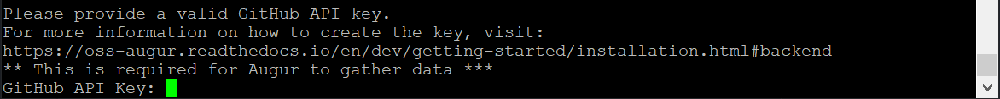

+-----------------+----------------------------------------------------------------------------------------------------+
| Input           | Explanation                                                                                        |
+=================+====================================================================================================+
| GitHub API Key  | See 'API key documentation <../../auth-api/api.html>'_ for details on how to get a GitHub API Key  |
+-----------------+----------------------------------------------------------------------------------------------------+
| GitLab API Key  | See 'API key documentation <../../auth-api/api.html>'_ for details on how to get a GitLab API Key  |
+-----------------+----------------------------------------------------------------------------------------------------+

------------------------

Lastly, you must choose whether to clone to an existing directory or create a new directory

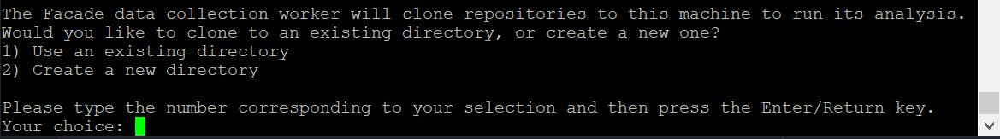

+--------------------------------+-------------------------------------------------------------------------------------+
| Input                          | Explanation                                                                         |
+================================+=====================================================================================+
| Use Existing or New Directory  | | Enter “1” if you already have a directory set up                                  |
|                                | |  You might have set up a directory on a previous install or created it beforehand |
|                                | | Enter “2” if you do not already have a directory set up                           |
|                                | |  If this is your first install and you did not create a directory beforehand      |
|                                | |  If you type an already existing directory, augur will recognize this and         |
|                                | |  will not recreate an existing directory                                          |
+--------------------------------+-------------------------------------------------------------------------------------+

If you choose “1” to use an existing directory:

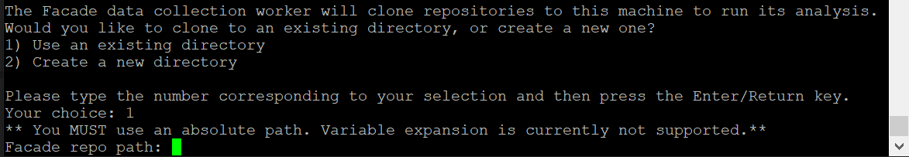

+-------------------+----------------------------------------------------------------------+
| Input             | Explanation                                                          |
+===================+======================================================================+
| Facade repo path  | | Type the directory that you set up to hold the clones repository   |
|                   | |  Remember that you cannot use “$HOME” type variables, you must     |
|                   | |  use an absolute path like “/home/dir1/dir2”                       |
+-------------------+----------------------------------------------------------------------+

If you choose “2” to create a new directory

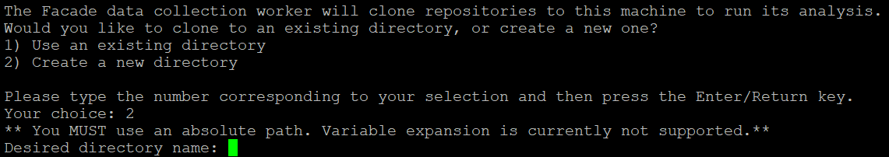

+-------------------------+-------------------------------------------------------------------------------+
| Input                   | Explanation                                                                   |
+=========================+===============================================================================+
| Desired directory name  | | Decide what folder/directory you want the repository to be stored in, then  |
|                         | | type the whole absolute path                                                |
|                         | |  Remember that you cannot use “$HOME” type variables, you must              |
|                         | |  use an absolute path like “/home/dir1/dir2”                                |
+-------------------------+-------------------------------------------------------------------------------+

------------------------------

After finishing the config file setup or if you choose “n” to not overwrite the config file:
Now you have a choice to install augur frontend dependencies

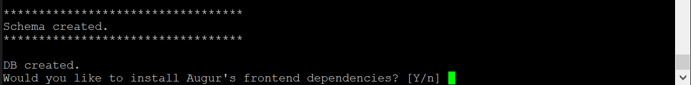

+---------------------------------------------+--------------------------------------------------------------+
| Input                                       | Explanation                                                  |
+=============================================+==============================================================+
| Install Augur’s frontend dependencies? Y/n  | | Enter “Y” for yes to install frontend dependencies         |
|                                             | | Enter “n” for no to skip installing frontend dependencies  |
+---------------------------------------------+--------------------------------------------------------------+
