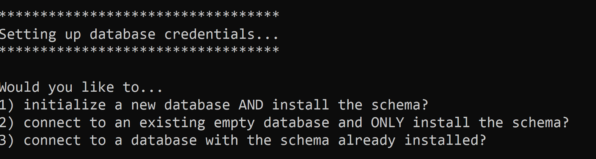
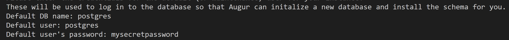
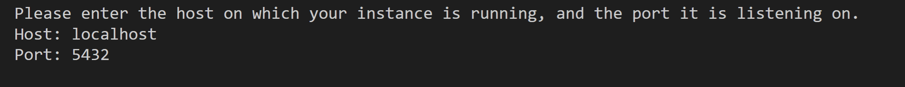
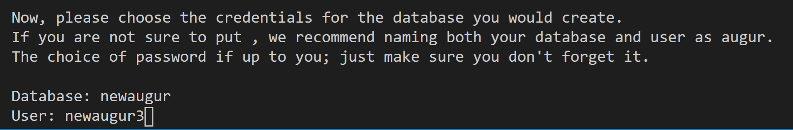
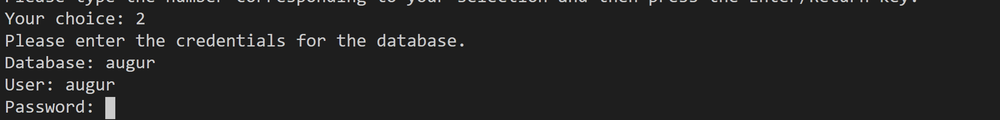
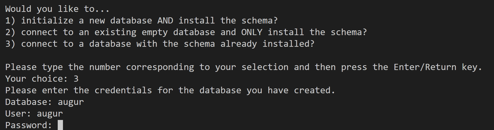

Database setup
===============
Abstract
--------
One of the reasons that Augur is so powerful is because of its `unified data model <../schema/data-model.html>`_.
In order to ensure this data model remains performant with large amounts of data, we use PostgreSQL as our database engine. 
We'll need to set up a PostgreSQL instance and create a database, after which Augur can take care of the rest.
Make sure to save off the credentials you use when you create the database, you'll need them again to configure Augur.

PostgreSQL Installation
=======================

Before you can install our schema, you will need to make sure you have write access to a PostgreSQL 10 or later database.

To download and install Postgres, follow the `instructions here. <https://www.postgresql.org/download/>`_

Using Docker 
------------

If you're looking for the fastest possible way to get Augur started, we recommend use our `database container <../docker/docker.html>`_. If you're looking to collect data long term, we recommend following the rest of this tutorial and setting up a persistent PostgreSQL installation.

.. warning::

    If you want to collect data over the long term, we strongly advise against `using a Docker container for your database <https://vsupalov.com/database-in-docker/>`_.

For Windows Users
-----------------

For windows specific instructions, `go here <https://www.postgresql.org/download/linux/>`_
You can also use WSL with a Ubuntu Distribution. `go there <https://docs.microsoft.com/en-us/windows/wsl/install-win10>`_
And then follow the linux instructions

For Linux Users 
---------------
For linux specific instructions, `go here <https://www.postgresql.org/download/linux/>`_

On Linux/Unix `pgAdmin <https://www.pgadmin.org/>`_ is a great open source alternative (dashboard).

For Mac Users
-------------
We recommend using `Postgres.app <https://postgresapp.com/>`_ if you're on macOS

Installation instructions can also be `found here <https://www.postgresql.org/download/macosx/>`_.

Creating a Database
===================

Running and Connecting to the Postgres Server 
---------------------------------------------

if you were using ``psql`` to connect to an instance on your machine ``localhost`` under the default user ``postgres`` on the default PostgreSQL port ``5432``, you might run something like this to connect to the server:

.. code-block:: bash

    $ psql -h localhost -U postgres -p 5432

Creating the Augur Table & Database User 
----------------------------------------

To setup your Augur table, run the following, 

.. code-block:: postgresql 
    
    CREATE DATABASE augur;
    CREATE USER augur WITH ENCRYPTED PASSWORD 'password';
    GRANT ALL PRIVILEGES ON DATABASE augur TO augur;

When connected to a psql terminal, run the following 

.. code-block:: postgresql

    postgres=# CREATE DATABASE augur;
    postgres=# CREATE USER augur WITH ENCRYPTED PASSWORD 'password';
    postgres=# GRANT ALL PRIVILEGES ON DATABASE augur TO augur;

Replace 'password' with your custom password. Make sure to save your password to a secure location for backup.

Using the Postgres Skeleton generator (tentative)
-------------------------------------------------
TODO might not implement this yet

Connecting to the database during "make install"
================================================
When you run, ``make install`` you will eventually be prompted with the following:

What do each of this mean?

1. Initialize a new database and install the schema 
---------------------------------------------------
You have a Postgres database, but you have not created a new "Augur" table / "Augur" user

Enter your default postgres database and password.
This will most likely be the ``postgres`` table and ``postgres`` user.

The password will be the ``root`` password for your database (postgres user).

Enter the IP address (hostname) of your postgres instance and the port it is hosted on (normally 5432)

Enter the new credentials for the augur user that augur will use to access the database.

2. Connect to an existing empty database and ONLY install the schema?
---------------------------------------------------------------------
You have a Postgres database with existing "augur" table and "augur" user

Enter the credentials for the "augur" user/table that augur will use to access the database.

Same instructions for hostname and port from Case 1

3. Connect to a database with schema already installed
------------------------------------------------------

Enter the existing credentials for the "augur" user/table with preexisting schema that augur will use to access the database.

Same instructions for hostname and port from Case 1