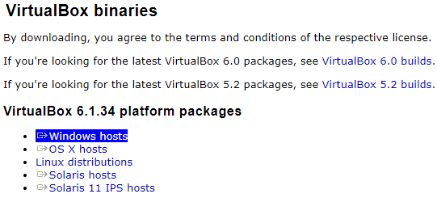
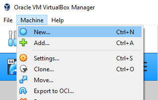
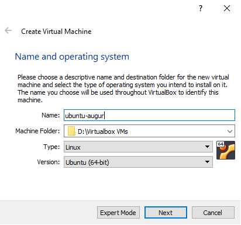
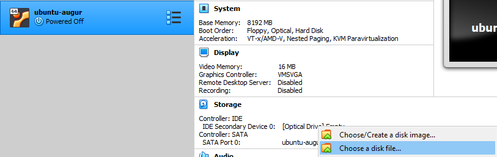
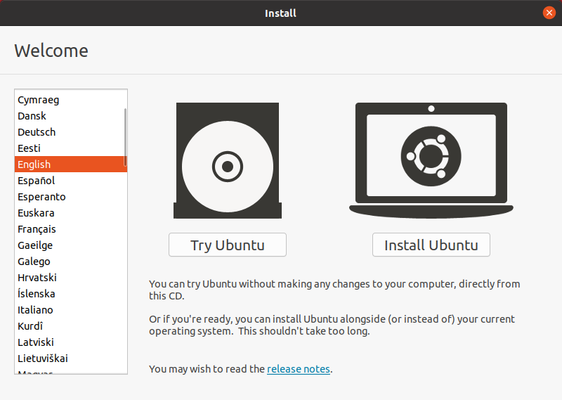
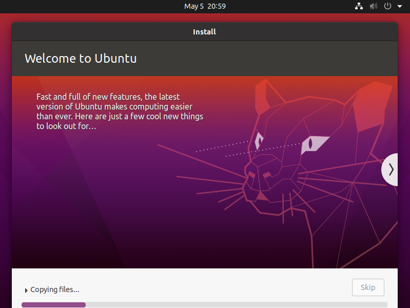
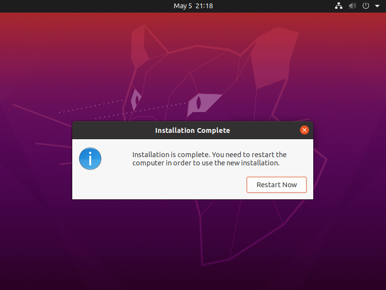

=================================================
Setting up an Ubuntu Virtual Machine
=================================================

Instructions specifically for Windows - learn how to set up an Ubuntu VirtualBox.

Setting up VirtualBox
~~~~~~~~~~~~~~~~~~~~~~~
- Vist the `Virtualbox download page <https://www.virtualbox.org/wiki/Downloads>`__.
  
- Download VirtualBox for "Windows hosts".

  
- Run the installer with the default options.

.. image:: images/VB2.png
   :width: 600
  
- Accept the warning for network interfaces.

.. image:: images/VB3.png
   :width: 600
  
- Open Virtualbox, and then click on "Machine" and then on "New".

  
- Name the machine whatever you want. For Type select "Linux" and for Version select "Ubuntu (64-bit)".

- Allocate at least 4GB of memory, and create a virtual hard disk with at least 20GB of memory.
- Continue with the default options. Your machine will be created.

Installing Ubuntu in VirtualBox
~~~~~~~~~~~~~~~~~~~~~~~~~~~~~~~~~
- Download the Desktop image of Ubuntu from the `Ubuntu download page <https://releases.ubuntu.com/20.04.4/>`__.
- Select the Optical Drive under Storage and add the .iso file you just downloaded.

- Start the VM by clicking on the green arrow.
- In the welcome window select Install Ubuntu.

- Continue the installation, and select the installation type: "Erase disk and install Ubuntu" when it asks.
- Once you reach this screen, your Ubuntu will be ready to use in few minutes.

- After the installation finishes, click "Restart Now" and your Ubuntu VM will be ready to use!

