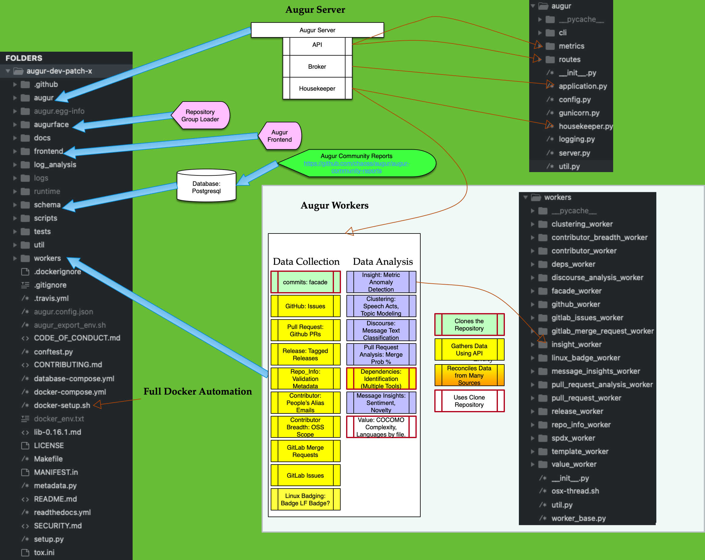

Augur Documentation
==================================

Welcome to the Augur project's official documentation. Below is a brief primer on the project and its goals; if you're new to the project, we recommend giving it a once-over as a gentle introduction. Otherwise, feel free to hop right into the docs!

.. toctree::
   :maxdepth: 2

   quick-start
   deployment/toc
   getting-started/toc
   development-guide/toc
   rest-api/api
   docker/toc
   schema/toc
.. 
  library-documentation/toc
.. 
  deployment/toc
.. 
  schema/toc

What is Augur?
~~~~~~~~~~~~~~~~

Augur is a software suite for collecting and measuring structured data about free and open source software (FOSS) communities.

Augur’s main focus is to measure the overall health and sustainability of open source projects, as these types of projects are system critical for nearly every software organization or company. We do this by gathering data about a project's repositories, normalizing that into our data model to provide useful metrics about your project’s health. For example, one of our metrics is Burstiness (How are short timeframes of intense activity, followed by a corresponding return to a typical pattern of activity, observed in a project?), which can paint a picture about a project’s focus as well as gain insight as to the potential stability of a project, and how its typical cycle of updates occurs. There are many more useful metrics, and you can find a full list of them here.

This software is developed as part of the CHAOSS (Community Health Analytics Open Source Software) project, and many of our metrics are implementations of the metrics defined by our awesome community. You can find more information about how to get involved on the CHAOSS website. If you want to see augur in action, you can view CHAOSS’s own augur instance. 

Current maintainers
--------------------
- `Derek Howard <https://github.com/howderek>`_
- `Sean P. Goggins <http://www.seangoggins.net>`_
- `Matt Snell <https://github.com/Nebrethar>`_
- `Andrew Brain <https://github.com/ABrain7710>`_

Former maintainers
--------------------
- `Christian Cmehil-Warn <https://github.com/christiancme>`_
- `Jonah Zukosky <https://github.com/jonahz5222>`_
- `Carolyn Perniciaro <https://github.com/CMPerniciaro>`_
- `Elita Nelson <https://github.com/ElitaNelson>`_
- `Michael Woodruff <https://github.com/michaelwoodruffdev/>`_
- `Max Balk <https://github.com/maxbalk/>`_

Contributors
--------------------
- `Dawn Foster <https://github.com/geekygirldawn/>`_
- `Ivana Atanasova <https://github.com/ivanayov/>`_
- `Georg J.P. Link <https://github.com/GeorgLink/>`_

GSoC 2020 participants
-----------------------
- `Akshara P <https://github.com/aksh555/>`_
- `Tianyi Zhou <https://github.com/tianyichow/>`_
- `Pratik Mishra <https://github.com/pratikmishra356/>`_
- `Sarit Adhikari <https://github.com/sarit-adh/>`_
- `Saicharan Reddy <https://github.com/mrsaicharan1/>`_
- `Abhinav Bajpai <https://github.com/abhinavbajpai2012/>`_

GSoC 2019 participants
-----------------------
- `Bingwen Ma <https://github.com/bing0n3/>`_
- `Parth Sharma <https://github.com/parthsharma2/>`_

GSoC 2018 participants
-----------------------
- `Keanu Nichols <https://github.com/kmn5409/>`_
