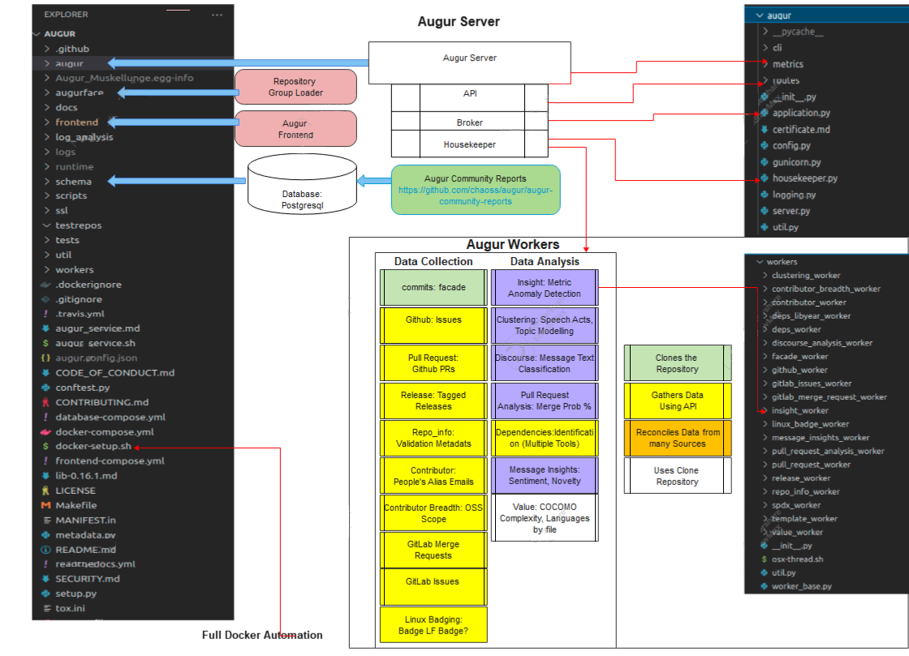

Augur Documentation
==================================

Welcome!
~~~~~~~~
~~~~~~~~

.. toctree::
   :maxdepth: 2

   quick-start
   deployment/toc
   getting-started/toc
   development-guide/toc
   rest-api/api
   docker/toc
   schema/toc
   login
.. 
  library-documentation/toc
.. 
  deployment/toc
.. 
  schema/toc

What is Augur?
~~~~~~~~~~~~~~~~

Augur is a software suite for collecting and measuring structured data about free and open-source software (FOSS) communities.

Augur’s main focus is to measure the overall health and sustainability of open source projects, as these types of projects are system critical for nearly every software organization or company. We do this by gathering data about project repositories and normalizing that into our data model to provide useful metrics about your project’s health. For example, one of our metrics is Burstiness. Burstiness – how are short timeframes of intense activity, followed by a corresponding return to a typical pattern of activity, observed in a project? This can paint a picture of a project’s focus and gain insight into the potential stability of a project and how its typical cycle of updates occurs. There are many more useful metrics, and you can find a full list of them `here <https://chaoss.community/metrics/>`_.

Augur gathers trace data for a group of repositories, normalize it into our data model, and provide a variety of metrics about that data.

This software is developed as part of the CHAOSS (Community Health Analytics Open Source Software) project. Many of our metrics are implementations of the metrics defined by our community. You can find more information about how to get involved on the `CHAOSS website <https://chaoss.community>`_. 

If you want to see augur in action, you can view CHAOSS’s augur instance `here <http://augur.chaoss.io>`_. 

Current maintainers
--------------------
- `Derek Howard <https://github.com/howderek>`_
- `Andrew Brain <https://github.com/ABrain7710>`_
- `Isaac Milarsky <https://github.com/IsaacMilarky>`_
- `John McGinnes <https://github.com/Ulincys>`_ 
- `Sean P. Goggins <https://github.com/sgoggins>`_ 

Former maintainers
--------------------
- `Carter Landis <https://github.com/ccarterlandis>`_
- `Gabe Heim <https://github.com/gabe-heim>`_
- `Matt Snell <https://github.com/Nebrethar>`_
- `Christian Cmehil-Warn <https://github.com/christiancme>`_
- `Jonah Zukosky <https://github.com/jonahz5222>`_
- `Carolyn Perniciaro <https://github.com/CMPerniciaro>`_
- `Elita Nelson <https://github.com/ElitaNelson>`_
- `Michael Woodruff <https://github.com/michaelwoodruffdev/>`_
- `Max Balk <https://github.com/maxbalk/>`_

Contributors
--------------------
- `Dawn Foster <https://github.com/geekygirldawn/>`_
- `Ivana Atanasova <https://github.com/ivanayov/>`_
- `Georg J.P. Link <https://github.com/GeorgLink/>`_

GSoC 2022 participants
-----------------------
- `Kaxada <https://github.com/kaxada>`_
- `Mabel F <https://github.com/mabelbot>`_
- `Priya Srivastava <https://github.com/Priya730>`_
- `Ramya Kappagantu <https://github.com/RamyaKappagantu>`_
- `Yash Prakash <https://gist.github.com/yash-yp>`_

GSoC 2021 participants
-----------------------
- `Dhruv Sachdev <https://github.com/Dhruv-Sachdev1313>`_
- `Rashmi K A <https://github.com/Rashmi-K-A>`_
- `Yash Prakash <https://github.com/yash2002109/>`_
- `Anuj Lamoria <https://github.com/anujlamoria/>`_
- `Yeming Gu <https://github.com/gymgym1212/>`_
- `Ritik Malik <https://gist.github.com/ritik-malik>`_

GSoC 2020 participants
-----------------------
- `Akshara P <https://github.com/aksh555/>`_
- `Tianyi Zhou <https://github.com/tianyichow/>`_
- `Pratik Mishra <https://github.com/pratikmishra356/>`_
- `Sarit Adhikari <https://github.com/sarit-adh/>`_
- `Saicharan Reddy <https://github.com/mrsaicharan1/>`_
- `Abhinav Bajpai <https://github.com/abhinavbajpai2012/>`_

GSoC 2019 participants
-----------------------
- `Bingwen Ma <https://github.com/bing0n3/>`_
- `Parth Sharma <https://github.com/parthsharma2/>`_

GSoC 2018 participants
-----------------------
- `Keanu Nichols <https://github.com/kmn5409/>`_
