Quickstart
===============

Get going fast! Intended for folks familiar with setting up DevOps environments. These instructions were tested using Ubuntu 20.04. Ubuntu 18x is no longer supported because the versions of Python3 available on it are not current. 

:ref:`Complete installation instructions with more complete explanations are located in our "Getting Started" section.<Getting Started>`

installing VirtualBox
~~~~~~~~~~~~~~~~~~~~~~~
Windows
---------
- Type "Download VirtualBox" in the search bar.
- Click on the website by Oracle.
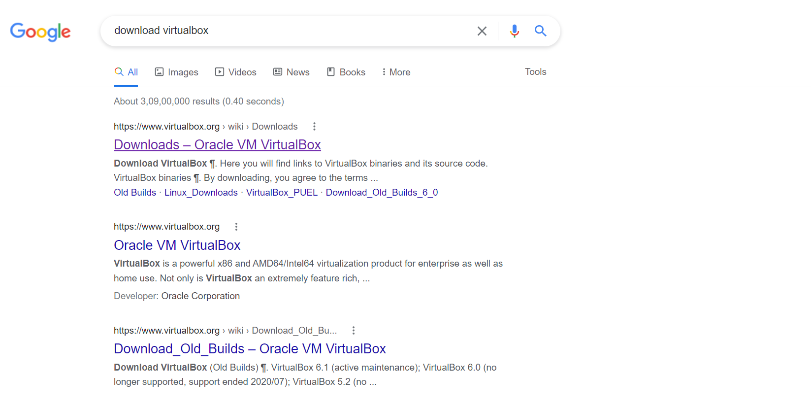
- Alternatively you can can go to the VirtualBox downloads page by visiting https://www.virtualbox.org/wiki/Downloads

- Download VirtualBox for "Windows hosts".
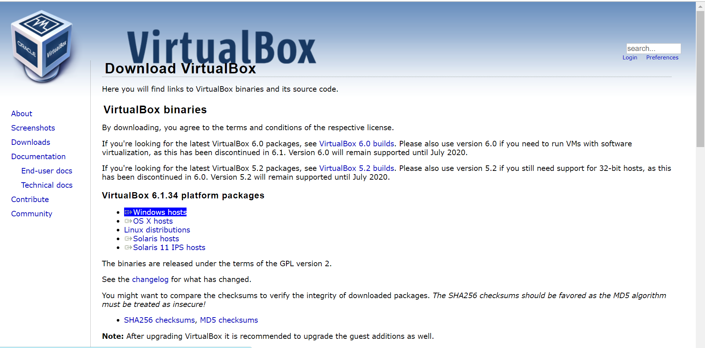
- Click on the downloaded VirtualBox and continue clicking Next with the default options.
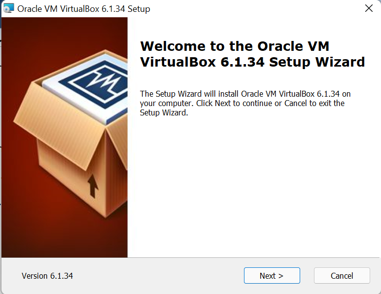
- Accept the warning for Network Interfaces.
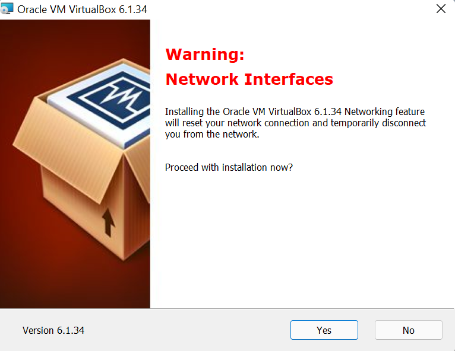
- Allow all permissions
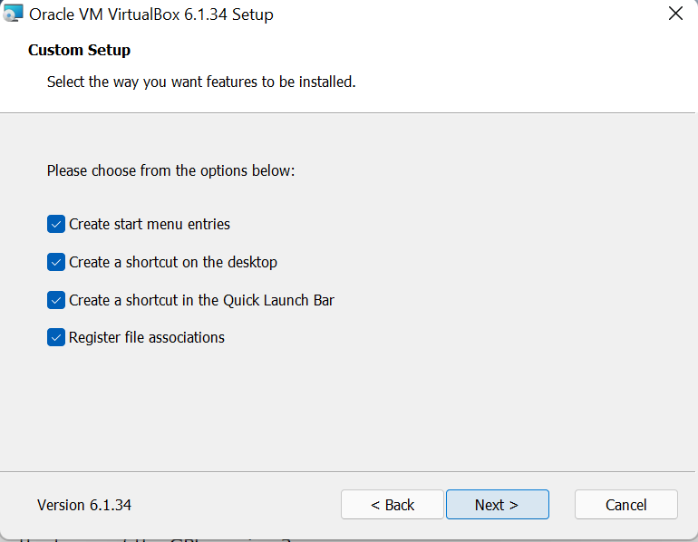

Macbook
----------
- Type "Download Virtualbox" in the search bar of your browser
- Click on the website by Oracle.

- Alternatively you can can go to the VirtualBox downloads page by visiting https://www.virtualbox.org/wiki/Downloads
- Download VirtualBox for "OS X hosts".
.. image:: development-guide/images/macbook1.png
  :width: 600 
- Open the downloaded file.
- Double click on the VirtualBox.pkg icon.
.. image:: development-guide/images/macbook2.png
  :width: 600 
- If you see the dialog popup, click on Allow.
.. image:: development-guide/images/macbook3.png
  :width: 600 
- Click on continue.
.. image:: development-guide/images/macbook4.png
  :width: 600 
- You are asked about installation location. You can change the installation location, but it is recommended to use the default.
- Click on Install.
.. image:: development-guide/images/macbook5.png
  :width: 600 
- Either provide finger print, or enter the password manually.
.. image:: development-guide/images/macbook6.png
  :width: 600 
- Installation will start, wait for a few seconds till the process is complete.
.. image:: development-guide/images/macbook7.png
  :width: 600 
- Installation successful message will be displayed on the window.
- Click on Close.
.. image:: development-guide/images/macbook8.png
  :width: 600 
- You will be asked to delete or keep the downloaded package. You can delete the package now. Click on Move to Trash.
.. image:: development-guide/images/macbook9.png
  :width: 600 

setting up VirtualBox 
~~~~~~~~~~~~~~~~~~~~~~~
- Open the VirtualBox by clicking on the Windows desktop icon for Windows, or by clicking the VirtualBox icon in launchpad for Macbook.
- Click "Machine" and then "New".
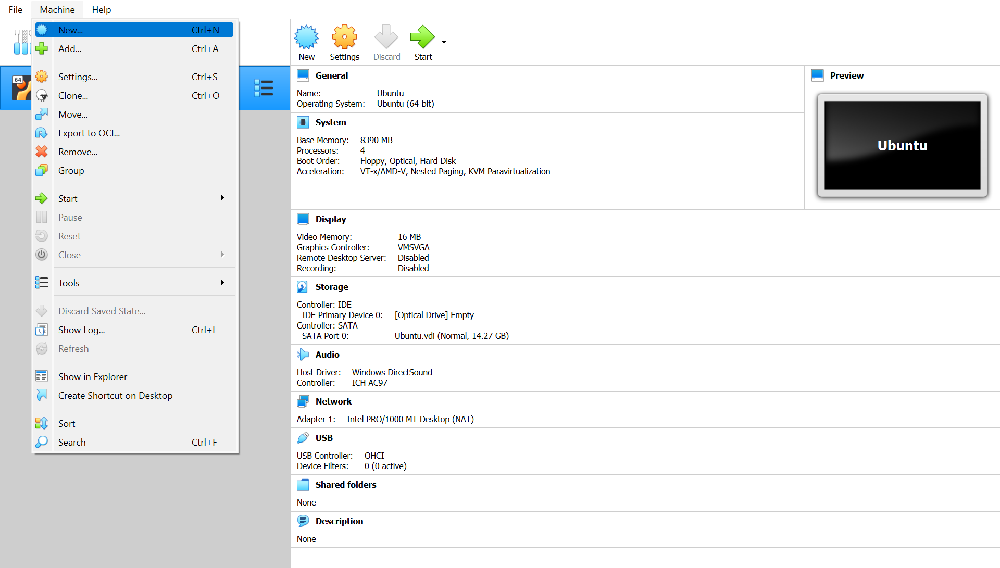
- Name the Machine. 
- In type select "Linux".
- In version select "Ubuntu (64-bits)".
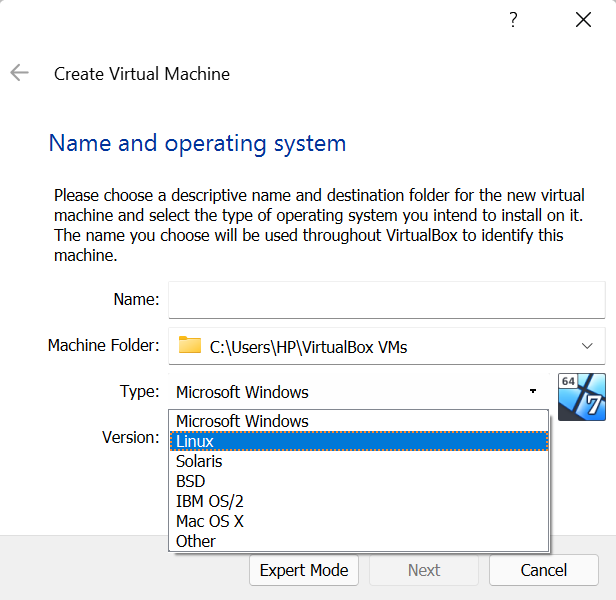
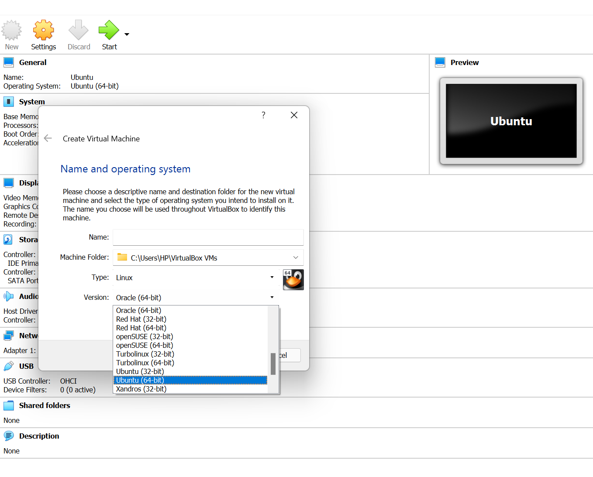
- Choose memory size, then click Next.
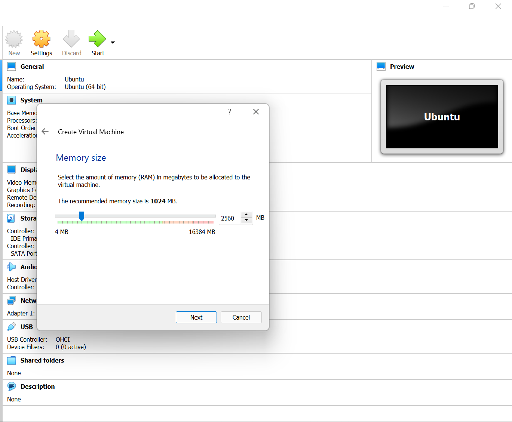
- Choose "Create a virtual hard disk now" and click Create.
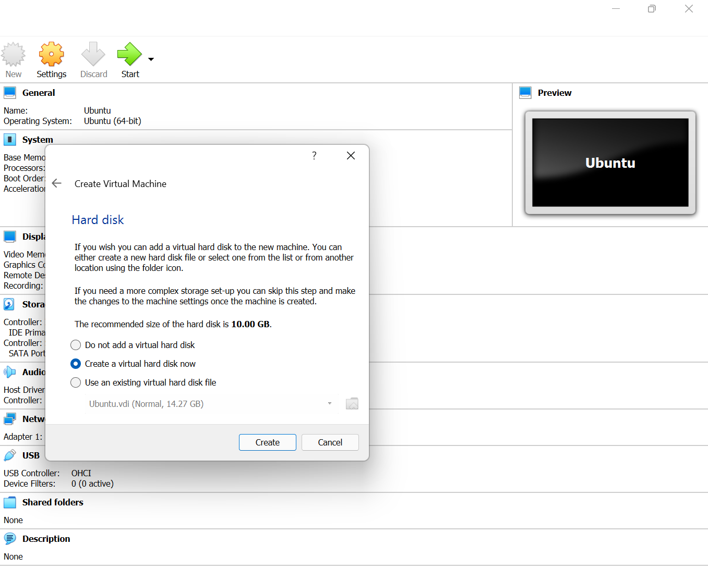
- Hard disk file type choose VDI (VirtualBox Disk Image) and click Next.
.. image:: development-guide/images/A11.png
  :width: 600  
- Storage on physical hard disk choose "Dynamically allocated" and click Next.
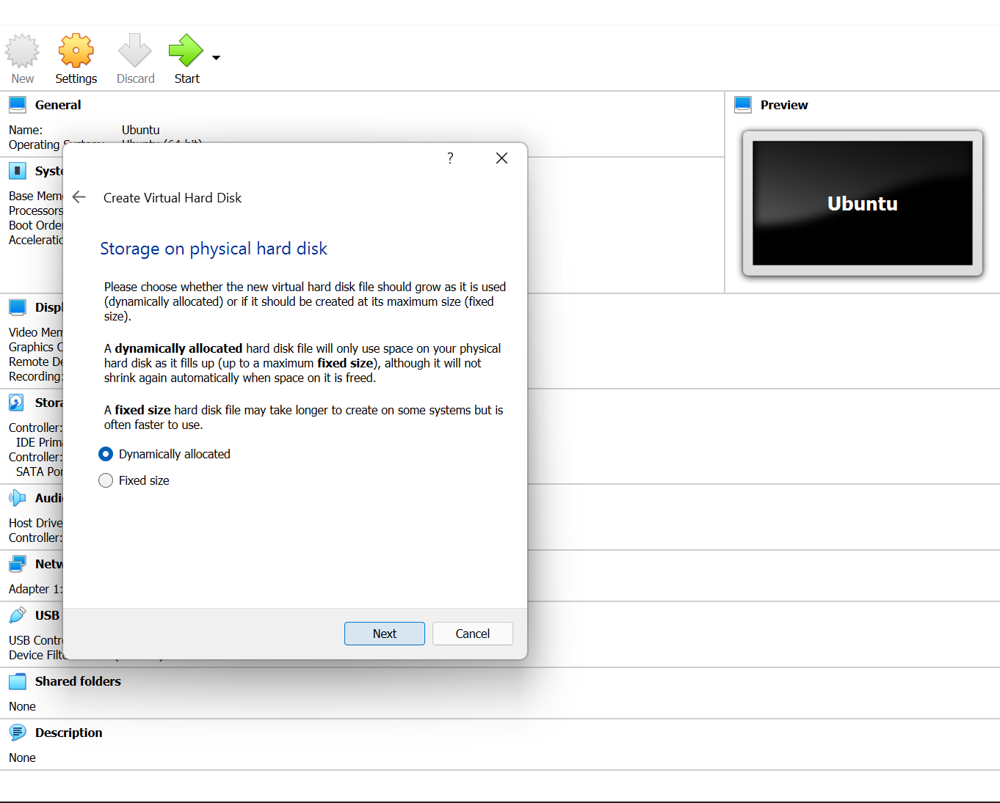
- Continue with the default options by clicking Next. Your machine will be created.
- Start the Machine.
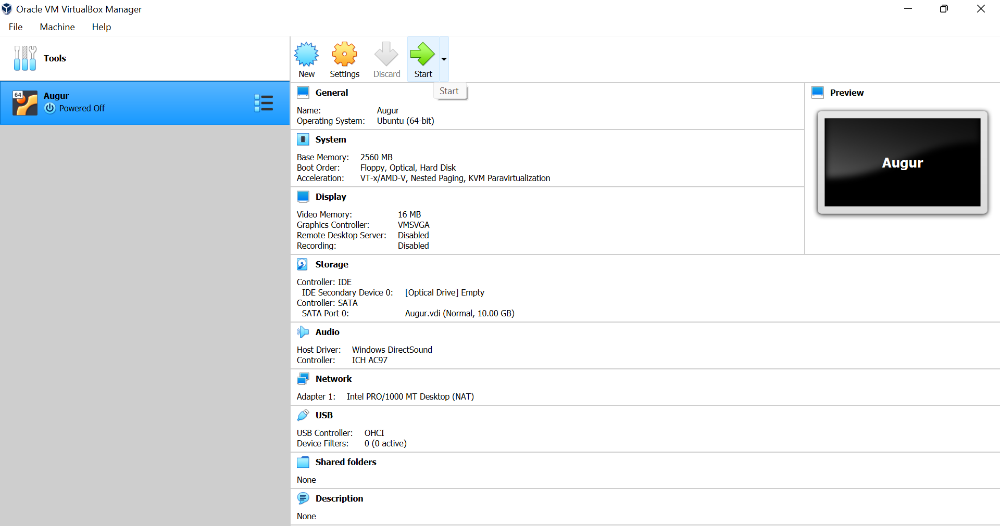

Ubuntu download 
~~~~~~~~~~~~~~~~~
- Type "Download Ubuntu" in the search bar.
- Click download (Prefer LTS version). Ubuntu will be downloaded.
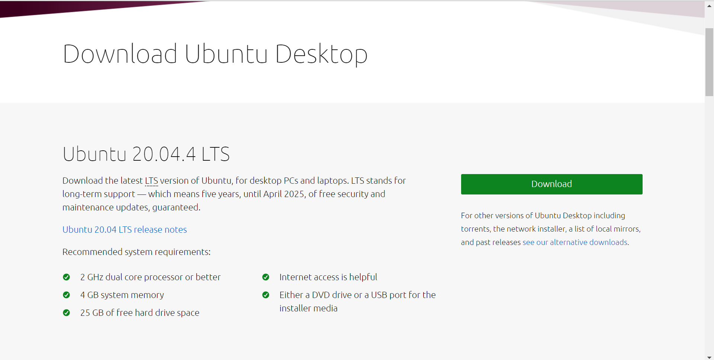

Installing Ubuntu in VirtualBox
~~~~~~~~~~~~~~~~~~~~~~~~~~~~~~~~~
- Open the machine which we have created earlier.
- Now in the pop-up, click on the disk image where you have downloaded your Ubuntu and click on finish.
- In the welcome window select Install Ubuntu and move forward with the default options.
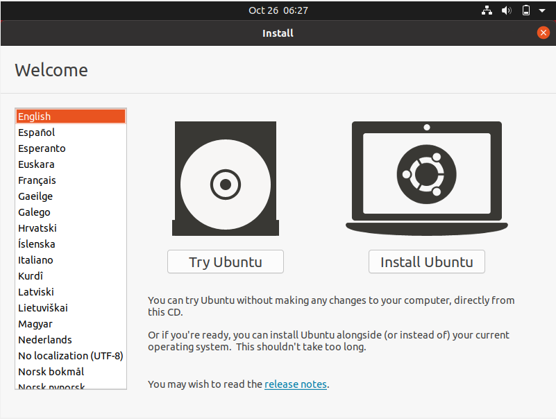
- Select Keyboard layout.
- Select Installation type "Erase disk and install Ubuntu".
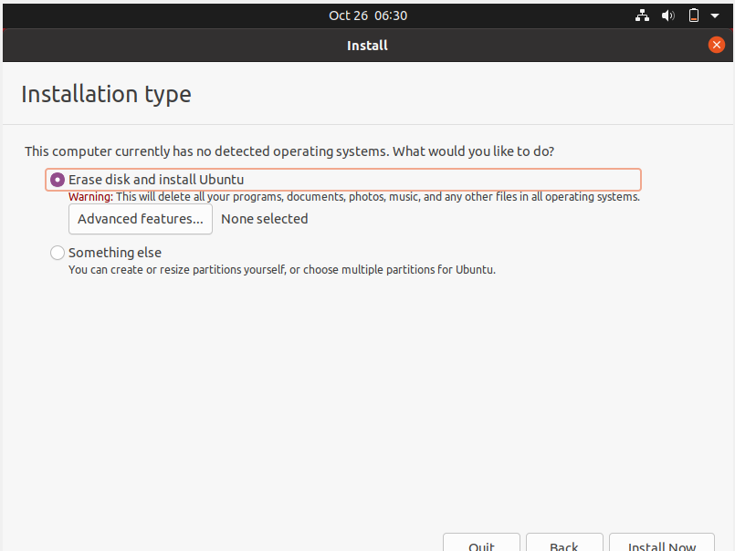
- Enter your details and set a password. Remember the password as this will be the password of the root user.

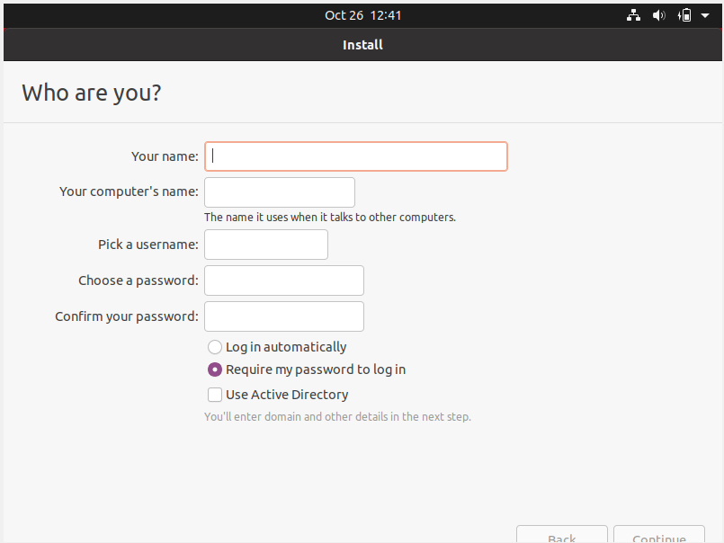
- Your Ubuntu will be ready to use in a few minutes.
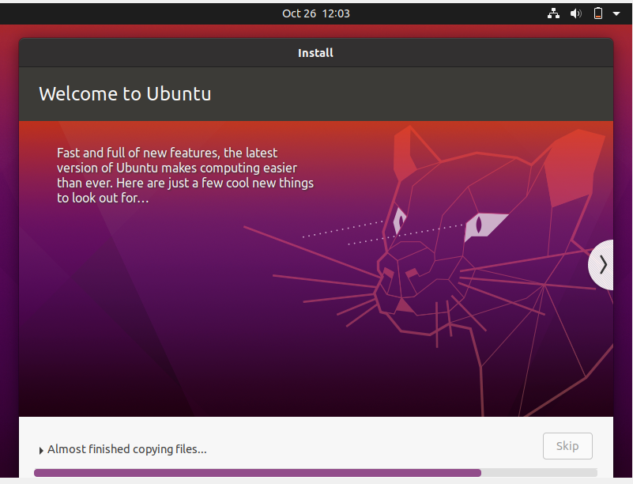

PostgreSQL Installation
~~~~~~~~~~~~~~~~~~~~~~~~
- Once Ubuntu is ready, next step is to install PostgreSQL. Run following commands in Ubuntu terminal.

.. code-block:: bash

	sudo apt update
	sudo apt upgrade
	sudo apt install software-properties-common
	sudo apt install python3-dev
	sudo apt install postgresql postgresql-contrib postgresql-client
	sudo apt install build-essential

- To connect to your PostgreSQL instance, run following commands.

.. code-block:: bash

	sudo service postgresql start
    sudo su -
    su - postgres
    psql

Then, once you've connected to your PostgreSQL instance, create a PostgreSQL database for Augur to use.

.. code-block:: postgresql

    postgres=# CREATE DATABASE augur;
    postgres=# CREATE USER augur WITH ENCRYPTED PASSWORD 'password';
    postgres=# GRANT ALL PRIVILEGES ON DATABASE augur TO augur;

Remember database name, user name and password. They will be required while building augur.

Git Configuration
~~~~~~~~~~~~~~~~~~~~~~~~
- In case git is not installed, run the given command.
.. code-block:: bash

	sudo apt install git

- Configure Git: These instructions assume the potential of large repositories that occasionally perform significant refactoring within a small number of commits. Our experience is that nearly all organizations have at least one project that meets these criteria.

.. code-block:: bash

	git config --global diff.renames true
	git config --global diff.renameLimit 200000
	git config --global credential.helper cache
	git config --global credential.helper 'cache --timeout=9999999999999'

- For each platform, perform a command-line login  to cache Git credentials for the LINUX user who operates Augur. This step is required in order to prevent the Facade Commit Counting Diesel from stalling on a command-line prompt when repositories move or disappear.

Install Go
~~~~~~~~~~~~~~~~~~~~~~~~
Two of Augur's workers use the Go programming language, which needs to be installed on your computer. Snap is the easiest way to install Go. If Snap does not work for you, see instructions here: https://www.digitalocean.com/community/tutorials/how-to-install-go-on-ubuntu-20-04

.. code-block:: bash

	sudo apt update
	sudo apt install snapd
	sudo snap install go --classic

Incase you encounter any problem following the above commands, try doing these first:

.. code-block:: bash

	sudo apt-get update && sudo apt-get install -yqq daemonize dbus-user-session fontconfig
	sudo daemonize /usr/bin/unshare --fork --pid --mount-proc /lib/systemd/systemd --system-unit=basic.target
	exec sudo nsenter -t $(pidof systemd) -a su - $LOGNAME
	snap version

If the last command returns successfully, you can try installing Go again using either of the two options above.
	
Python Virtual Environment Configuration
~~~~~~~~~~~~~~~~~~~~~~~~
- Set up a Python virtual environment (Python 3.8 and above are now required. Python 3.9 and python 3.10 work as well, though we have tested Python 3.9 on more platforms.)
- Clone and install Augur as a regular user.

.. code-block:: bash

	sudo apt install make
	sudo apt-get install python3-venv
	python3 -m venv $HOME/.virtualenvs/augur_env
	source $HOME/.virtualenvs/augur_env/bin/activate
	sudo apt install python-pip-whl
	sudo apt install python3-pip
	sudo apt install pythonpy
	python -m pip install --upgrade pip

Setting up Augur
~~~~~~~~~~~~~~~~~~

- Clone and install Augur as a regular user. Run the following commands.
- Keep the database name, user name and password from PostgreSQL Installation section ready.
- You also require GitHub token and GitLab toke. Login to Github and get personal access token. Copy and keep this token for use. Same for GitLab. Login and keep personal access token ready.

.. code-block:: bash

	# Ensure you are logged in as your user on Github and change the "<YOUR_GITHUB_USERNAME>" to your Github username (e.g. "sean")
	git clone https://github.com/<YOUR_GITHUB_USERNAME>/augur.git
	cd augur/
	source $HOME/.virtualenvs/augur_env/bin/activate
	make install-dev

- Follow prompts. You will need database credentials, a file location for cloned repositories, a GitHub Token, and a GitLab token.

- Seven sample repositories will load by default. You can delete them if you want to use your repositories by deleting records from the `repo` table first, then deleting the records from the `repo_groups` table.

.. code-block:: bash

	augur --help
	augur db --help
	augur backend --help

Loading Repositories
~~~~~~~~~~~~~~~~~~~~~~~~
The commands for loading repos are:

.. code-block:: bash

	augur db add-github-org
	augur db add-repo-groups
	augur db add-repos

We recommend that you test your instance using 50 or fewer repositories before undertaking a more substantial data collection. When you do take on more collection, you can "collect data faster" by adding additional tokens to the `worker_oauth` table in the `augur_operations` schema and increasing the number of workers for the pull request and GitHub worker blocks in the `augur.config.json` file that generates at install.

