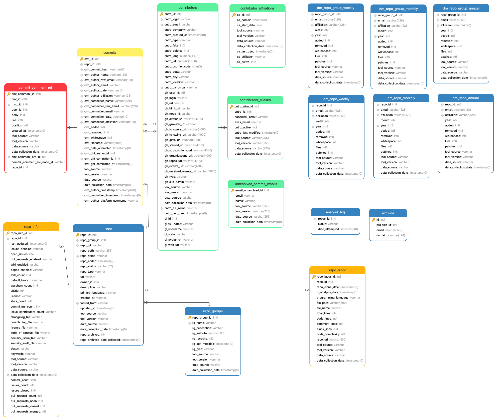

Complete Data Model on a Page
=================================

The latest version of Augur includes a schema_ that brings together data around key artifacts of open source software development.

This document details how to create the schema as well as some information on its contents and design.

-------------------------------------------------------
Complete Data Model, With Key Table Types Highlighted
-------------------------------------------------------

.. image:: schema.png
  :width: 1200
  :alt: Augur Unified Schema

-------------------------------------------------------
Complete Data Model, For Current Release
-------------------------------------------------------

-------------------------------------------------------
Creating the schema
-------------------------------------------------------

The process for creating the schema is detailed in the  `database section <../getting-started/database.html>`_ of the Getting Started guide.

-------------------------------------------------------
Schema Overview
-------------------------------------------------------

Augur Data
-------------------------------------------------------

The ``augur_data`` schema contains *most* of the information analyzed
and constructed by Augur. The origin’s of the data inside of augur are
from data collection tasks and populate this schema.:

1. ``augur.tasks.github.*``: Tasks that pull data from the GitHub API.
Primarily, pull requests and issues are collected before more complicated 
data. Note that all messages are stored in Augur in the ``messages`` table. 
This is to facilitate easy analysis of the tone and characteristics of text 
communication in a project from one place.

2. ``augur.tasks.git.facade_tasks``: Based on
http://www.github.com/brianwarner/facade, but substantially modified in
the fork located at http://github.com/sgoggins/facade. The modifications
include modularization of code, connections to Postgresql data instead
of MySQL and other changes noted in the commit logs. Further modifications
have been made to work with augur as well as seemlessly integrate it into 
data collection.

3. ``augur.tasks.data_analysis.insight_worker.tasks``: Generates summarizations from raw data
gathered from commits, issues, and other info.

4. ``augur.tasks.github.pull_requests.tasks``: Collects Pull Request related data such as commits, contributors,assignees, etc. from the Github API and stores it in the Augur database.

Augur Operations
-------------------------------------------------------

The ``augur_operations`` tables are where most of the operations tables
exist. There are a few, like ``settings`` that remain in
``augur_data`` for now, but will be moved. They keep records related to
analytical history and data provenance for data in the schema. They also
store information including API keys.

Some key tables in this schema include:

- ``config``, which contains the config options for the application. Key options include the facade repo_directory as well as primary api key.

- ``collection_status``, contains the status of each aspect of data collection for each repo added to Augur. For example, it shows the status of the facade jobs for every repository.

SPDX
-------------------------------------------------------

The ``spdx`` schema serves the storage for software bill of materials
and license declarations scans on projects, conducted using this fork of
the DoSOCSv2 project: https://github.com/Nebrethar/DoSOCSv2

.. _schema:
