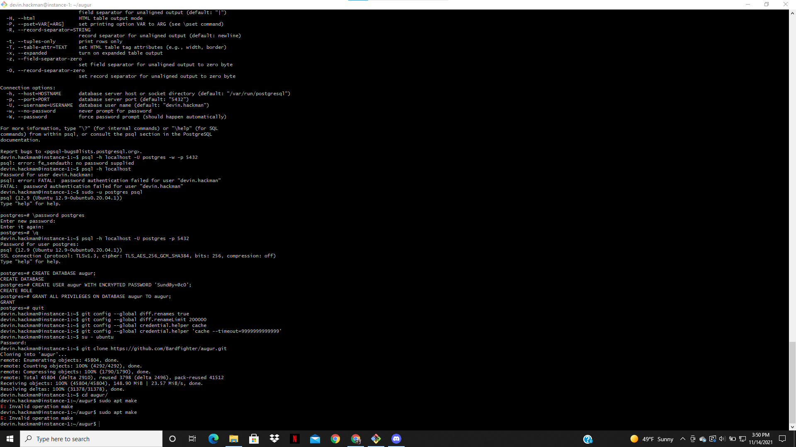
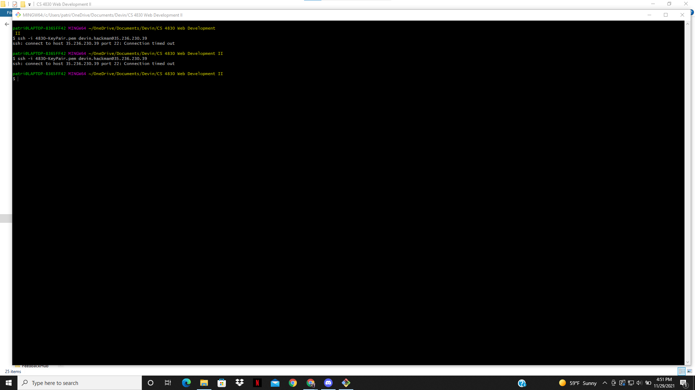
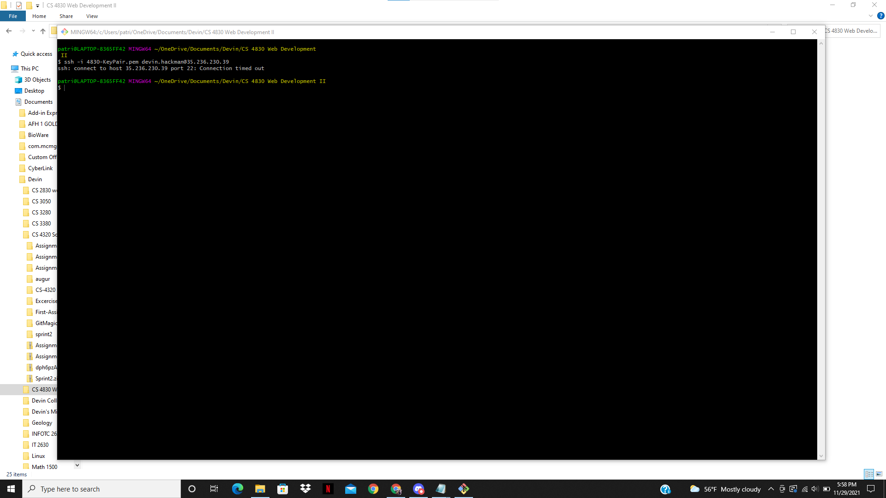

Obstacles
-----------------------------------------------------------------------------------------------------------------------------------------
November 14 2021

When trying to deploy the augur fork onto an Ubunto instance, there were many issues that prevented the deployment.
The provided instructions as part of the class had many parts where the sequence wouldn't allow further pogression.
Using the quick settup, https://oss-augur.readthedocs.io/en/main/, as an example:

When creating a PostgreSQL database for Augur to use, there were issues with the commands. 
psql -h localhost -U postgres -p 5432 wouldn't work since the user postgres, being something that I hadn't touched before as this was a presented instruction,
required a password that I would need to provide. As I had nothign to do with the user postgres, I instead opted to use the command: psql -h localhost
This then lead to the system asking for the password to my user dvin.hackman. However, it would seem that none of the passwords for my own user worked.
It turned out that I had to log into PostgreSQL as a root user and set the password for postgres.

Yet after all of this, when I finally got throug and even enabled git, there came a problem when it was time to use the sudo apt make command.
Specifically the error "Invalid operation make." 

I know that this was an issue that was brought up in class, but as far as I can remember this 
was used as an example of other issues that arrized when people were trying to get Augur to work. The instructor said that there woul be a 
video posted that would explian how to install augur into a server and get it working, but that so far hasn't appeared. As such, our team has gotten stuck 
in terms of getting the a deployable instance.

In the near future I will work with the professor to get this instance deployed, but until then, it's going to have to go unfulfilled.

-------------------------------------------------------------------------------------------------------------------------------------------

November 29 2021

In the process of getting Augur set up in my Google Cloud Console instance, an issue arrised wehre I was incapable of getting connected to it. 
Ever since setting the front end of Augur to compile, there would be an arror that the connection took too long and was timed out.

When setting up Augur with the professor and seeing this error, he suggested that the issue could either be that the internet I was using was too slow,
causing the connection to time out, or that the compiling of the front end was taking up to much of the server's CPU.
After going to another internet source, specifically the engineering building, the same error came up.

And even after waiting the entire fall break, the connection would still time out with the same error, implying that the problem couldn't have been the compiling
since suitable time was given for it to compelte, specifically more than a week's worth of time.

Due to this issue, my team was unable to get a Hello World instance for our Augur application or server instance since we couldn't SSH into the server. The problem
also persists into connecting to the instance other ways, such as FileZilla or going to the public DNS normaly. As such, I have no way of knowing what the issue 
could be, or how to accomplish the Hello World portion of Sprint 2. Hopefully I will be able to work with the professor in getting this issue resolved before we are 
required to start interacting with the application's code as I still don;t have a working instance of Augur.

----------------------------------------------------------------------------------------------------------------------------------------------------------------------

