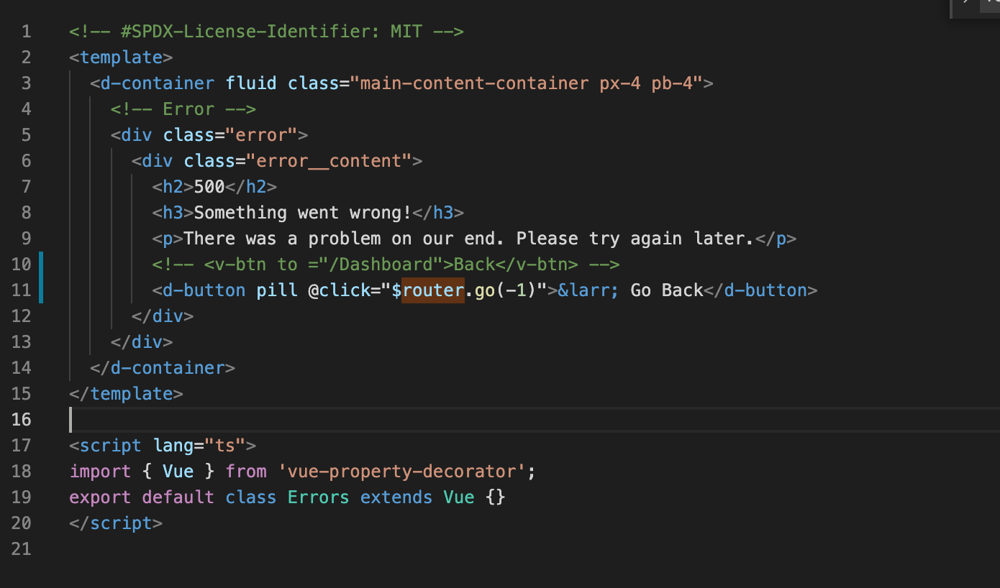

#Sprint 3 Documentation
##Darian Hu
==
**Darian:** before even beginning my code I ran into obstacles from environment setup having to revert back to an old node version 
wasn't too difficult with various tutorials on NVM found on the internet however the part that was difficult was realizing that I 
did not have the frontend.config.json file which really puzzled me as to why I was having compile error while trying to run augur 
however it seemed that I just didn't have this file while one of my groupmate's did and I was able to get the app's frontend running locally. 
Once this was done I did have some difficulties trying to understand how the routing was working and through various searches online I came across 
a couple ways to reroute and I decided that I would combine multiple methods in order to solve this issue and now the back button works on the error page.

As seen below:

Debugging Links
==
https://router.vuejs.org/guide/#javascript

https://stackoverflow.com/questions/61948628/typeerror-cannot-read-property-router-of-null-in-vuetify
