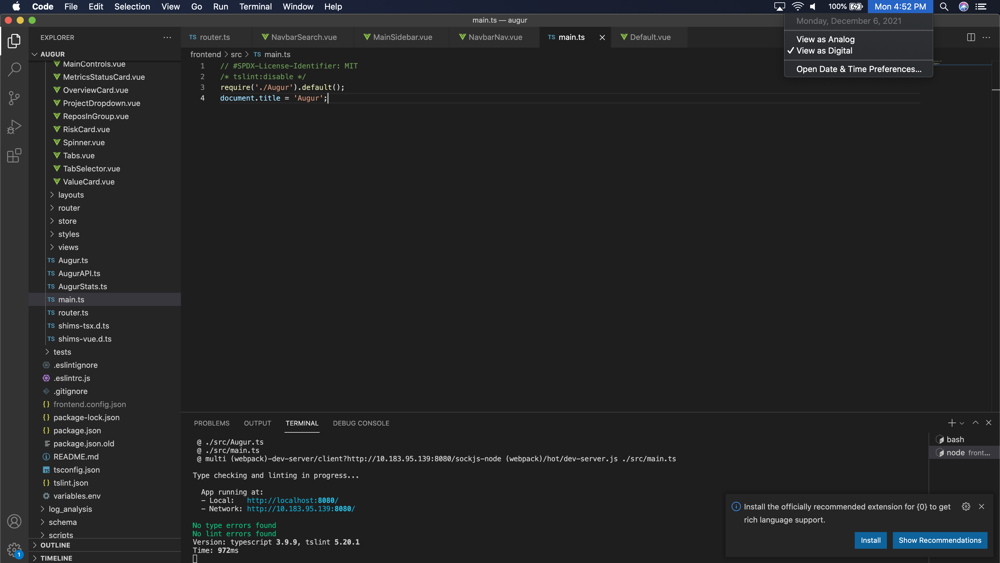

# Sprint 3 Documentation
## Kermit Kreder

For this sprint, I worked on two changes. I changed the page's title and I changed the search bar default text to be more clear. 
I started with the page title I decided to change the title statically so it is the same for every page as seen below.

This could dynamically be done by routing but as I was still investigating and getting used to the code I decided to start by just getting it changed statically.

The next change was to change the search bar default text as seen below.

This was changed as before the default text telling you what to do was somewhat unclear and not as user friendly as it could be. 
I removed the astrisks and stated more clear what would be searched so that the user would have a better experience.