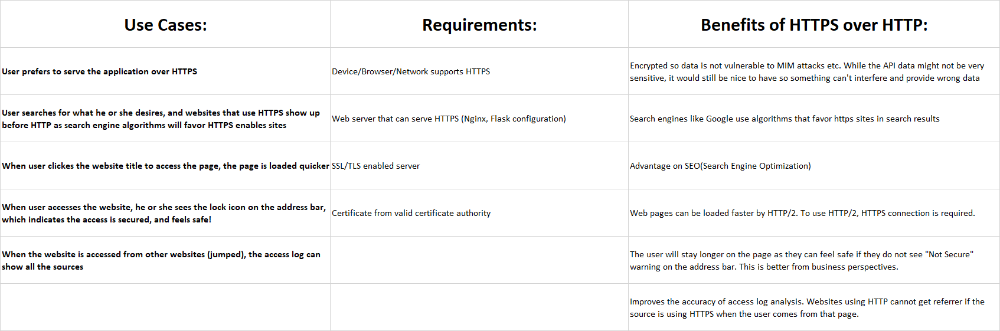
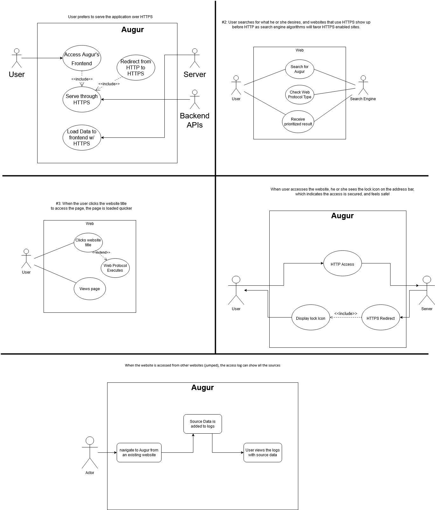

# Group 11 Progress Report

## Sprint 1

Our scope for our project will remain the same. We were able to get our version of Augur up and running and have planned out what we will be doing for the next sprint. During this sprint we started by choosing our topic, fixing the mixed content error due to the APIs returning HTTP content when modern browsers require HTTPS. After we chose our topic we mapped out our use cases and requirements.

[Link to running augur instance/server: https://dev.osshealth.io/](https://dev.osshealth.io/)

### USE CASES:
1. User prefers to serve the application over HTTPS
2. User searches for what he or she desires, and websites that use HTTPS show up before HTTP as search engine algorithms will favor HTTPS enables sites
3. When user clicks the website title to access the page, the page is loaded quicker
4. When user accesses the website, he or she sees the lock icon on the address bar, which indicates the access is secured, and feels safe!
5. When the website is accessed from other websites (jumped), the access log can show all the sources

### REQUIREMENTS:
1. Device/Browser/Network supports HTTPS
2. Web server that can serve HTTPS (Nginx, Flask configuration)
3. SSL/TLS enabled server
4. Certificate from valid certificate authority

Once these were planned out, we created a jira board and began creating tasks that will need to be done in the next sprint. Finally, we created diagrams to show the user flow of each use case.

Our project is going according to how we initially planned it at the start so there are no changes to scope and our plan will remain the same. Throughout sprint 2, we will re-evaluate if our scope needs to be changed as we progress in our project but as of now, we will continue to work as originally planned.

### Sprint 1 Obstacles, Reflection, and Goals

For this sprint we encountered almost no obstacles. Sean was able to get out instance of Augur up and running quickly and easily which allowed us to get an early start on the rest of the sprint. This allowed for more time to plan out the rest of our project and work on the other deliverables for sprint 1. Once we selected out topic, we started working on the planning stage and we were able to figure out our use cases, requirements, and research of HTTP compared to HTTPS. Furthermore, we were able to compile a list of resources that we will be able to use in the future that will help with the coming sprints. As for our goals, they remain unchanged from when we first started our project. We will start on our design phase soon which lines up with the time line we initially anticipated. This Sprint was very smooth and we are set up to move into sprint 2 effortlessly.

## Sprint 2

For this sprint, we simply added all our feature branches (one for each sprint) for our project, and finished our design work by completing our diagramming for each of the use cases listed above from sprint 1. [Our hello world server is the same](https://dev.osshealth.io/) and is already HTTPS enabled through Nginx, we just need to work on enabling HTTPS for the APIs/backend which is planned for sprint 3.

### Design/Diagrams

### Sprint 2 Obstacles, Reflection, and Goals

For this sprint we encountered zero obstacles. We had our plan for this sprint and everyone's work delegated out even before the end of sprint 1, before the start of this one. We split each use case diagram between ourselves and all got our diagrams completed in time. In our meetings we asked any questions we may have had about the project and ensured we were all on the same page. Sean compiled our deliverables for the sprint and turned them in when they were originally due on the 21st before the extention was given.

## Sprint 3

## Sprint 4
