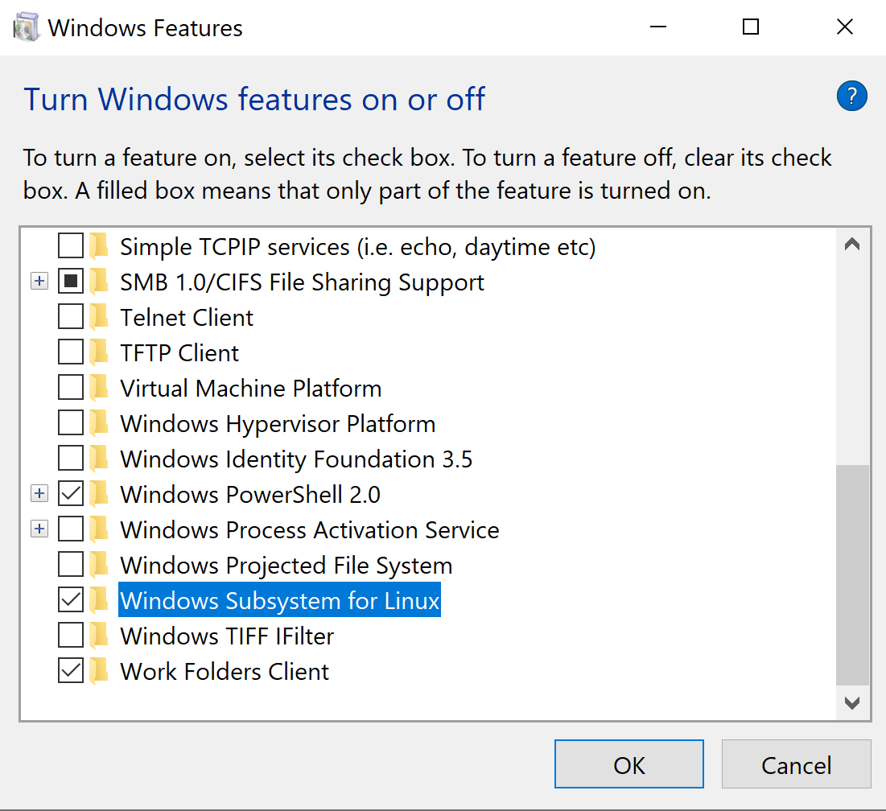
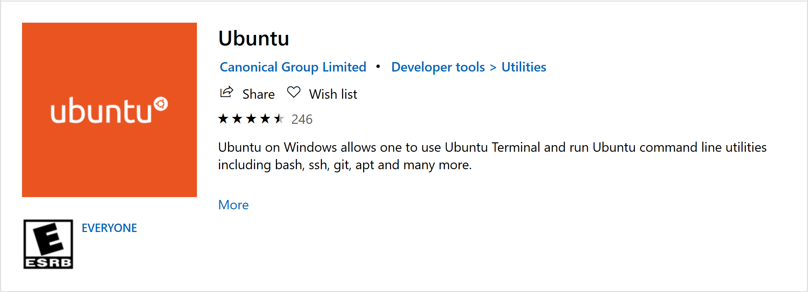
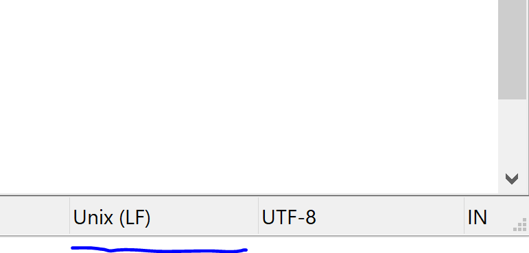

# Augur Windows Installation

https://github.com/chaoss/augur/issues/403

## Enable Linux Subsystem

First, you will need to enable bash in Windows. Navigate to control panel and find "Turn Windows features on or off". Now enable Windows Subsystem for Linux. (You may need to restart your machine after doing this).



Before you can use the subsystem in the command line, you'll need to install a Linux distro in the Microsoft store as well. I'll be using [Ubuntu](https://www.microsoft.com/en-us/p/ubuntu/9nblggh4msv6?activetab=pivot:overviewtab) for this example. The commands below will be different depending on the distro you go with.



Now that you have the subsystem enabled, and a distro to use, you can launch the subsystem using the ```wsl``` command.

Your Windows file system is still here too so you can access all of your other files. Your C:/ directory can be found at /mnt/c/.

## Dependencies

### Python

You'll need to get Python and VirtualEnv on the subsystem. Make sure you're in wsl and run the following:
```
sudo apt-get install python3.7
sudo update-alternatives –install /usr/bin/python3 python3 /usr/bin/python3.7 2
sudo update-alternatives –config python3

pip3 install virtualenv
```

Now navigate to a directory you'll remember and create a virtual environment for Augur.
```
virtualenv –python=python3 newaugur
```

This will create a directory, newaugur (or whatever you named it). From the directory you ran the last command, use
```
source newaugur/bin/activate
```
to start the virtual environment. Use ```deactivate``` to exit the environment.

### Nodejs and NPM

Install NPM on Ubuntu (so we're still under wsl) with:
```
sudo apt-get install nodejs
```

Check the version of your Node install and make sure that it's the latest release. You may have trouble installing the latest version of NodeJs. [NVM](https://github.com/nvm-sh/nvm) is great way to easily get it. If you didn't have any trouble getting the latest version, go ahead and skip this step.

NVM Installation:
```
curl -o- https://raw.githubusercontent.com/nvm-sh/nvm/v0.35.0/install.sh | bash

nvm install --lts
```

## PostgreSQL Setup

You will need PostgreSQL on the linux subsystem for this to work. You can also install [PostgreSQL](https://www.postgresql.org/download/windows/) for Windows if you want to use pgAdmin. This will automatically install postgres on the Windows side, so you will have postgres running in two places, Windows and WSL.

Go into the subsystem using ```wsl``` and run the following:
```
sudo apt install postgresql postgresql-contrib
```

After it installs, you must start it manually:

```
sudo /etc/init.d/postgresql start
```

You will need to create the database (and the user) you intend to load Augur's schemas into BEFORE installing Augur. It has trouble creating the database on its own.

To do this, you can access the postgres account, and then get to the postgres prompt with these commands:
```
sudo -i -u postgres
psql
```
From here, you can run the commands to create the user and database.
```
create database augur;
create user augur with encrypted password 'mypass';
grant all privileges on database augur to augur;
```

Postgres has the default port 5432. If you had postgres setup on the Windows side, then it will likely be on port 5433 instead. Check the port on the WSL command line with
```
sudo netstat -plunt | grep postgres
```
before installing Augur. You will need to know this for later.

If you're having trouble with the postgres setup, [this](https://www.digitalocean.com/community/tutorials/how-to-install-and-use-postgresql-on-ubuntu-18-04) is a really nice walkthrough.

When you go to Augur install, you'll need to create the database and user first, and select option 2.

## Getting Augur

Using GitBash for Windows, or just through the wsl terminal, clone Augur from its [repository](https://github.com/chaoss/augur).
It is more risk free to do this on the Linux subsystem.

## Installation

Congratulations, you now have everything you need to install and run Augur. Let's hope this works!
First, from the Windows command line, type ```wsl``` to start the subsystem. Now launch the virtual environment.
```
source newaugur/bin/activate
```

Navigate to where you cloned the Augur repository. From the Augur directory, you can run ```make install``` to start the Augur installation.

Augur should now install just like on a Unix system.
Should you reboot your computer, you will need to start postgres again with
```
sudo /etc/init.d/postgresql start
```
(in wsl) before running Augur.

Augur should now install just like on a Unix system. Make sure when it asks you if you'd like to create a database to select option 2, which will let you use the database you created earlier.

### Potential (Likely) Issues
Once everything is done, the frontend will likely not work immediately. This is because the default server address is set to 0.0.0.0, which scares and confuses windows. Go on over to augur.config.json in the Augur root directory. Find the key "Server" and set its "host" value to "localhost". Now in your python virtual environment (within WSL), in the Augur directory, run ```make rebuild``` to update this setting. Run the front and backends after this, and you should have a working Augur installation on Windows!

NOTE: You may get errors on the install if you cloned Augur using Windows and not WSL. Make sure that the scripts in augur/util/scripts/install all are using Unix line endings. If they aren't you can easily change them in a text editor. This is usually in the bottom right, and should look something like this (LF is Unix).


If it says CRLF, then you will need to change it to LF.
